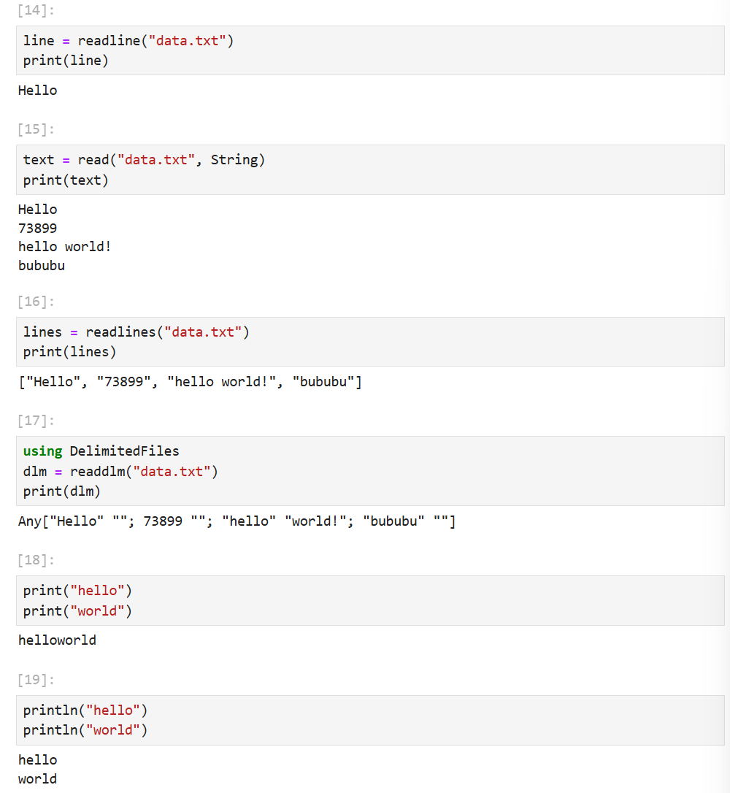
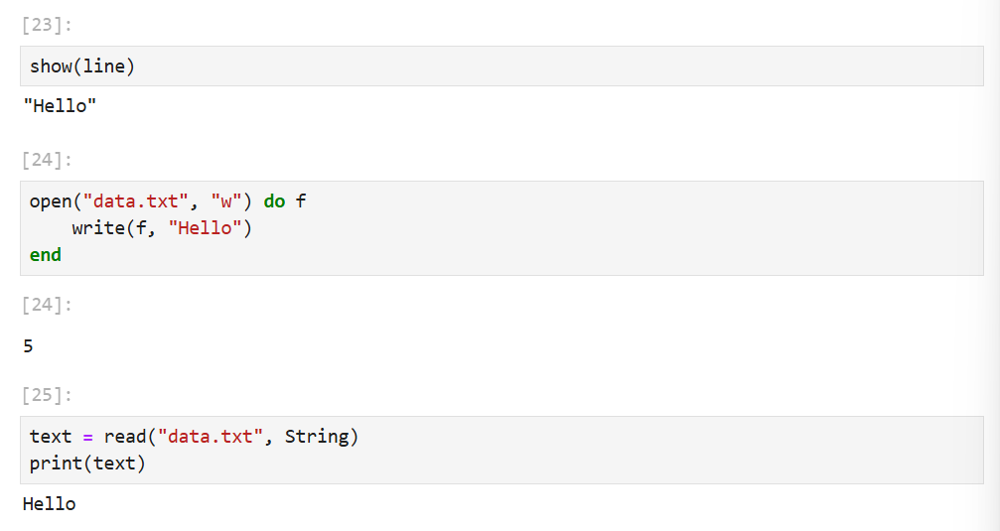
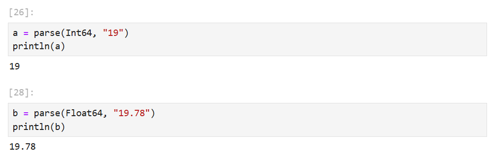
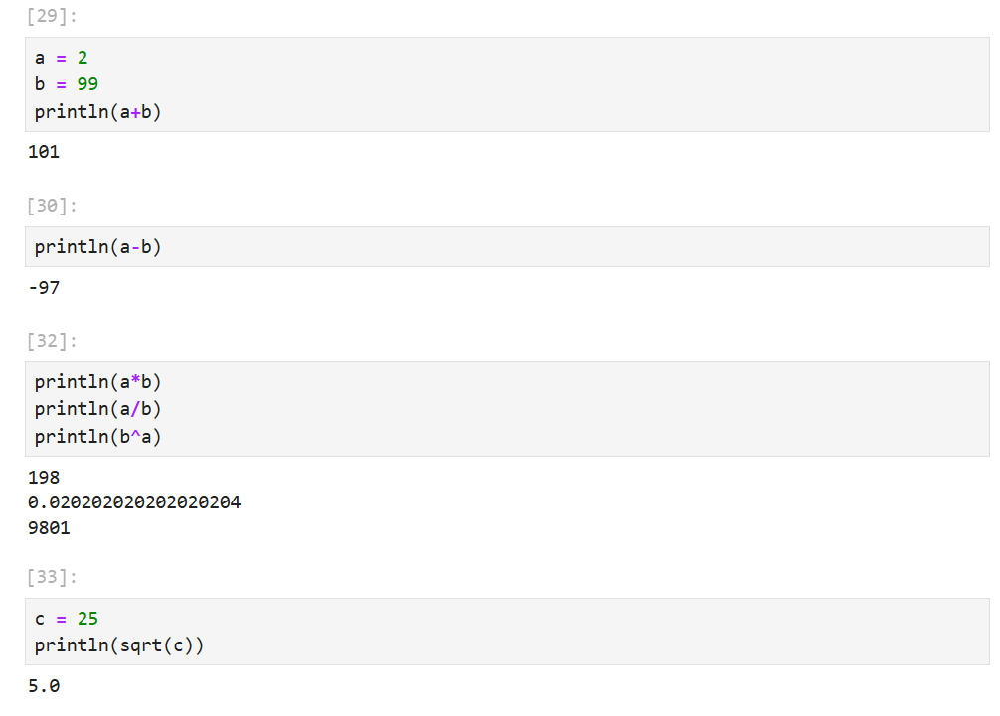
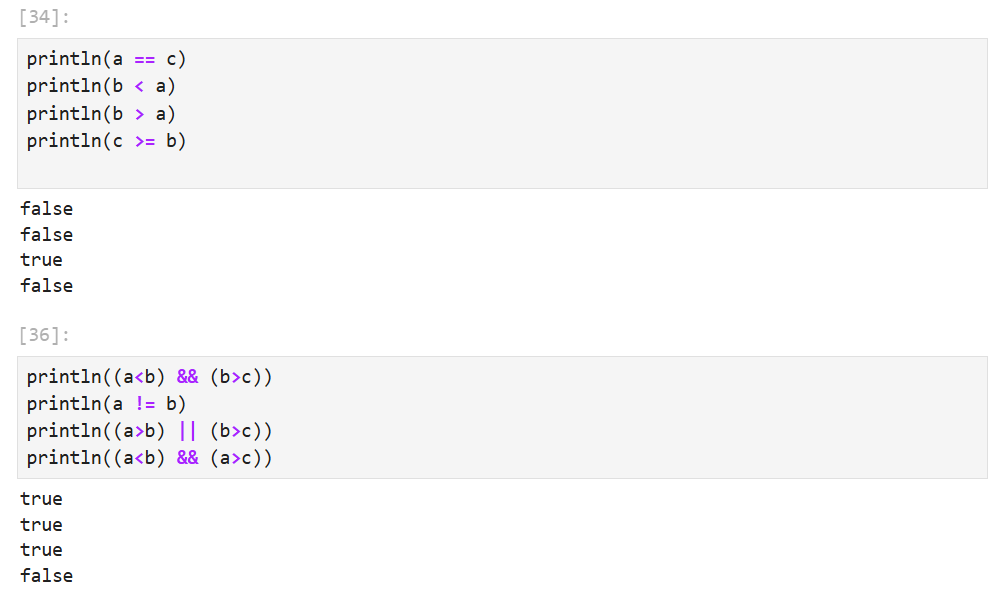
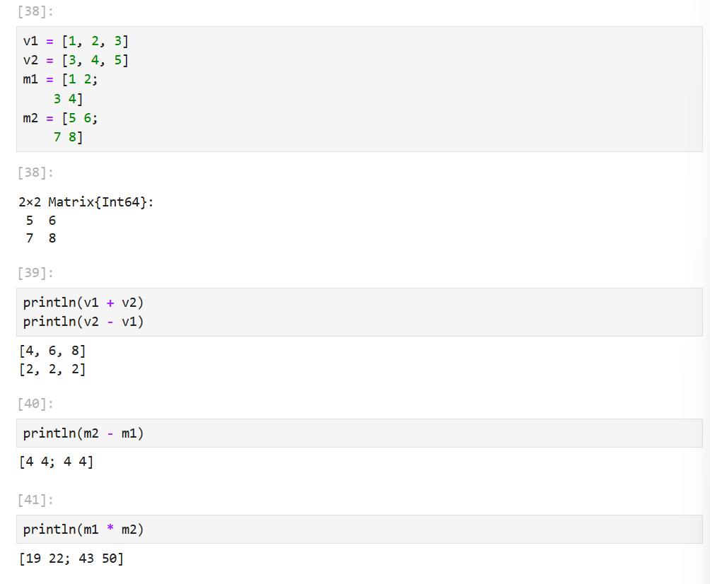
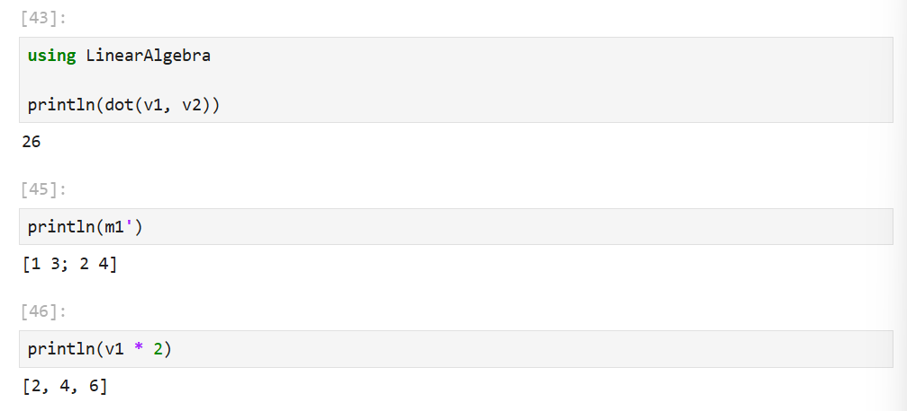

---
## Front matter
title: "Лабораторная работа №1"
subtitle: "Julia. Установка и настройка. Основные
принципы."
author: "Барабанова Кристина"

## Generic options
lang: ru-RU
toc-title: "Содержание"

## Bibliography
bibliography: bib/cite.bib
csl: pandoc/csl/gost-r-7-0-5-2008-numeric.csl

## Pdf output format
toc: true
toc-depth: 2
lof: true
lot: false
fontsize: 12pt
linestretch: 1.5
papersize: a4
documentclass: scrreprt

## I18n polyglossia
polyglossia-lang:
  name: russian
  options:
    - spelling=modern
    - babelshorthands=true
polyglossia-otherlangs:
  name: english

## I18n babel
babel-lang: russian
babel-otherlangs: english

## Fonts
mainfont: DejaVu Serif
sansfont: DejaVu Sans
monofont: DejaVu Sans Mono
mainfontoptions: Ligatures=TeX
romanfontoptions: Ligatures=TeX
sansfontoptions: Ligatures=TeX,Scale=MatchLowercase
monofontoptions: Scale=MatchLowercase,Scale=0.9

## Biblatex
biblatex: true
biblio-style: "gost-numeric"
biblatexoptions:
  - parentracker=true
  - backend=biber
  - hyperref=auto
  - language=auto
  - autolang=other*
  - citestyle=gost-numeric

## Pandoc-crossref LaTeX customization
figureTitle: "Рис."
tableTitle: "Таблица"
listingTitle: "Листинг"
lofTitle: "Список иллюстраций"
lotTitle: "Список таблиц"
lolTitle: "Листинги"

## Misc options
indent: true
header-includes:
  - \usepackage{indentfirst}
  - \usepackage{float}
  - \floatplacement{figure}{H}
---

# Цель работы

Основная цель работы — подготовить рабочее пространство и инструментарий для работы с языком программирования Julia, на простейших примерах познакомиться с основами синтаксиса Julia.

# Задание

1. Изучите документацию по основным функциям Julia для чтения / записи / вывода информации на экран: read(), readline(), readlines(), readdlm(), print(),
println(), show(), write(). Приведите свои примеры их использования, поясняя
особенности их применения.
2. Изучите документацию по функции parse(). Приведите свои примеры её использования, поясняя особенности её применения.
3. Изучите синтаксис Julia для базовых математических операций с разным типом переменных: сложение, вычитание, умножение, деление, возведение в степень, извлечение
корня, сравнение, логические операции. Приведите свои примеры с пояснениями по
особенностям их применения.
4. Приведите несколько своих примеров с пояснениями с операциями над матрицами
и векторами: сложение, вычитание, скалярное произведение, транспонирование,
умножение на скаляр.

# Выполнение лабораторной работы

## 1. 
Изучите документацию по основным функциям Julia для чтения / записи / вывода информации на экран: read(), readline(), readlines(), readdlm(), print(),
println(), show(), write(). Приведите свои примеры их использования, поясняя
особенности их применения.

{#fig:001 width=70%}

{#fig:002 width=70%}

## 2.

Изучите документацию по функции parse(). Приведите свои примеры её использования, поясняя особенности её применения.

{#fig:003 width=70%}

---

## 3. 

Изучите синтаксис Julia для базовых математических операций с разным типом переменных: сложение, вычитание, умножение, деление, возведение в степень, извлечение
корня, сравнение, логические операции. Приведите свои примеры с пояснениями по
особенностям их применения.

{#fig:004 width=70%}

{#fig:005 width=70%}

---

## 4. 

Приведите несколько своих примеров с пояснениями с операциями над матрицами
и векторами: сложение, вычитание, скалярное произведение, транспонирование,
умножение на скаляр.

{#fig:006 width=70%}

{#fig:007 width=70%}

---

## 5. Выводы

Таким образом, я подготовила рабочее пространство и инструментарий для работы с языком программирования Julia, на простейших примерах познакомилась с основами синтаксиса Julia.

---

