---
## Front matter
title: "Лабораторная работа №3"
subtitle: "Управляющие структуры"
author: "Барабанова Кристина"

## Generic options
lang: ru-RU
toc-title: "Содержание"

## Bibliography
bibliography: bib/cite.bib
csl: pandoc/csl/gost-r-7-0-5-2008-numeric.csl

## Pdf output format
toc: true
toc-depth: 2
lof: true
lot: false
fontsize: 12pt
linestretch: 1.5
papersize: a4
documentclass: scrreprt

## I18n polyglossia
polyglossia-lang:
  name: russian
  options:
    - spelling=modern
    - babelshorthands=true
polyglossia-otherlangs:
  name: english

## I18n babel
babel-lang: russian
babel-otherlangs: english

## Fonts
mainfont: DejaVu Serif
sansfont: DejaVu Sans
monofont: DejaVu Sans Mono
mainfontoptions: Ligatures=TeX
romanfontoptions: Ligatures=TeX
sansfontoptions: Ligatures=TeX,Scale=MatchLowercase
monofontoptions: Scale=MatchLowercase,Scale=0.9

## Biblatex
biblatex: true
biblio-style: "gost-numeric"
biblatexoptions:
  - parentracker=true
  - backend=biber
  - hyperref=auto
  - language=auto
  - autolang=other*
  - citestyle=gost-numeric

## Pandoc-crossref LaTeX customization
figureTitle: "Рис."
tableTitle: "Таблица"
listingTitle: "Листинг"
lofTitle: "Список иллюстраций"
lotTitle: "Список таблиц"
lolTitle: "Листинги"

## Misc options
indent: true
header-includes:
  - \usepackage{indentfirst}
  - \usepackage{float}
  - \floatplacement{figure}{H}
---

# Цель работы

Основная цель работы — освоить применение циклов функций и сторонних для Julia пакетов для решения задач линейной алгебры и работы с матрицами.

# Задание

1. Используя циклы while и for:
– выведите на экран целые числа от 1 до 100 и напечатайте их квадраты;
– создайте словарь squares, который будет содержать целые числа в качестве ключей и квадраты в качестве их пар-значений;
– создайте массив squares_arr, содержащий квадраты всех чисел от 1 до 100.
2. Напишите условный оператор, который печатает число, если число чётное, и строку
«нечётное», если число нечётное. Перепишите код, используя тернарный оператор.
3. Напишите функцию add_one, которая добавляет 1 к своему входу.
4. Используйте map() или broadcast() для задания матрицы 𝐴, каждый элемент которой увеличивается на единицу по сравнению с предыдущим.
5. Задайте матрицу 𝐴 следующего вида:
6. Создайте матрицу 𝐵 с элементами 𝐵𝑖1 = 10, 𝐵𝑖2 = −10, 𝐵𝑖3 = 10, 𝑖 = 1, 2, … , 15.
Вычислите матрицу 𝐶 = 𝐵𝑇𝐵.
7. Создайте матрицу 𝑍 размерности 6 × 6, все элементы которой равны нулю, и матрицу 𝐸, все элементы которой равны 1. 
8. В языке R есть функция outer(). Фактически, это матричное умножение с возможностью изменить применяемую операцию (например, заменить произведение на сложение или возведение в степень).
9. Решите следующую систему линейных уравнений с 5 неизвестными:
рассмотрев соответствующее матричное уравнение Ax = 𝑦. Обратите внимание на
особый вид матрицы 𝐴. Метод, используемый для решения данной системы уравнений, должен быть легко обобщаем на случай большего числа уравнений, где матрица
𝐴 будет иметь такую же структуру.
10. Создайте матрицу 𝑀 размерности 6 × 10, элементами которой являются целые числа,
выбранные случайным образом с повторениями из совокупности 1, 2, … , 10.
– Найдите число элементов в каждой строке матрицы 𝑀, которые больше числа 𝑁
(например, 𝑁 = 4).
– Определите, в каких строках матрицы 𝑀 число 𝑀(например,𝑀 = 7) встречается
ровно 2 раза?
– Определите все пары столбцов матрицы 𝑀, сумма элементов которых больше 𝐾
(например, 𝐾 = 75).

# Выполнение лабораторной работы

## 1.

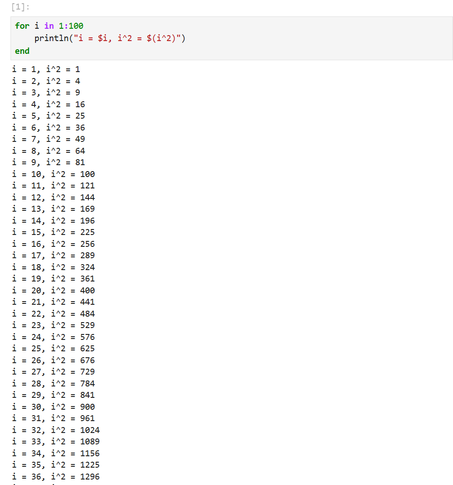{#fig:001 width=70%}

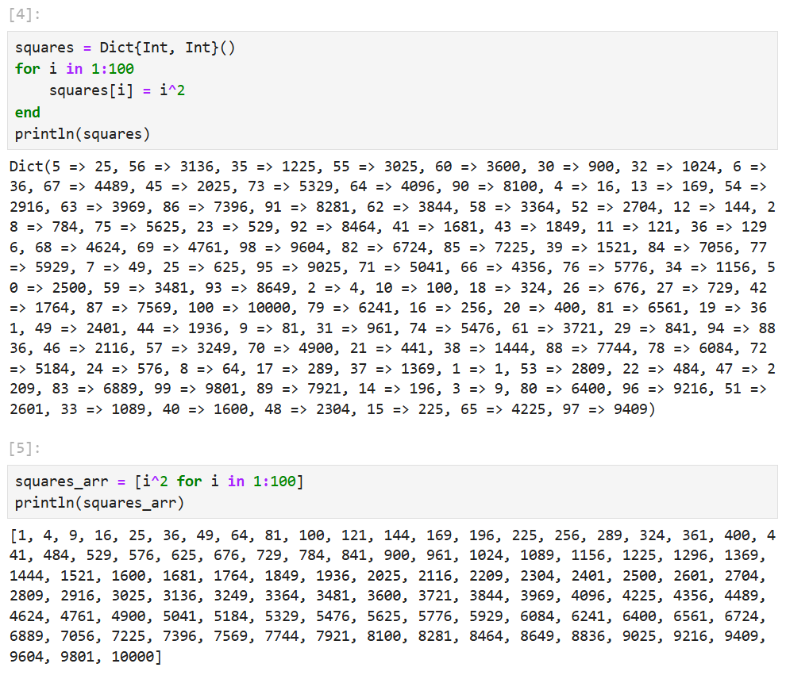{#fig:002 width=70%}

## 2.

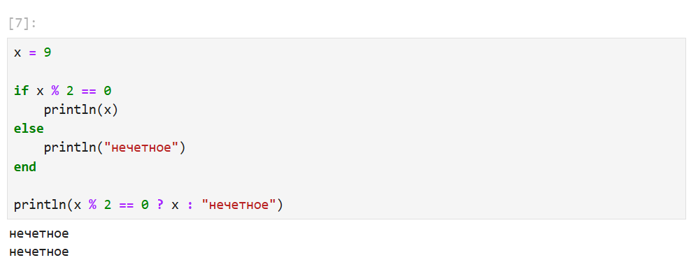{#fig:003 width=70%}

## 3.

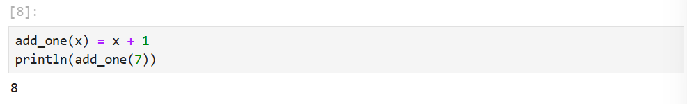{#fig:004 width=70%}

## 4.

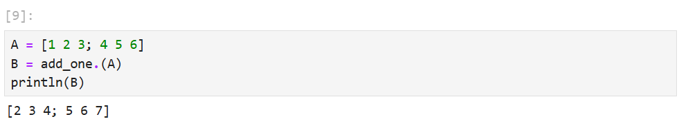{#fig:005 width=70%}

## 5.

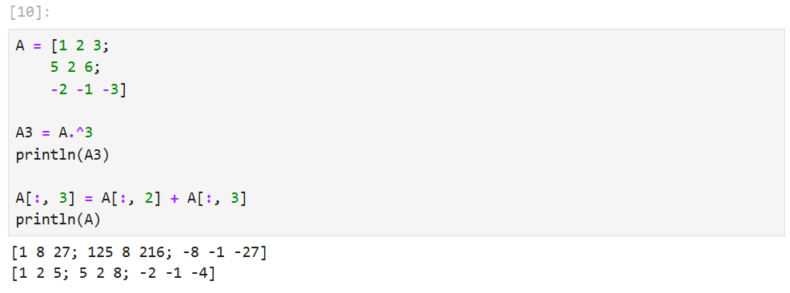{#fig:006 width=70%}

## 6. 

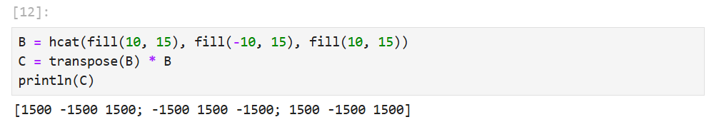{#fig:007 width=70%}

## 7.

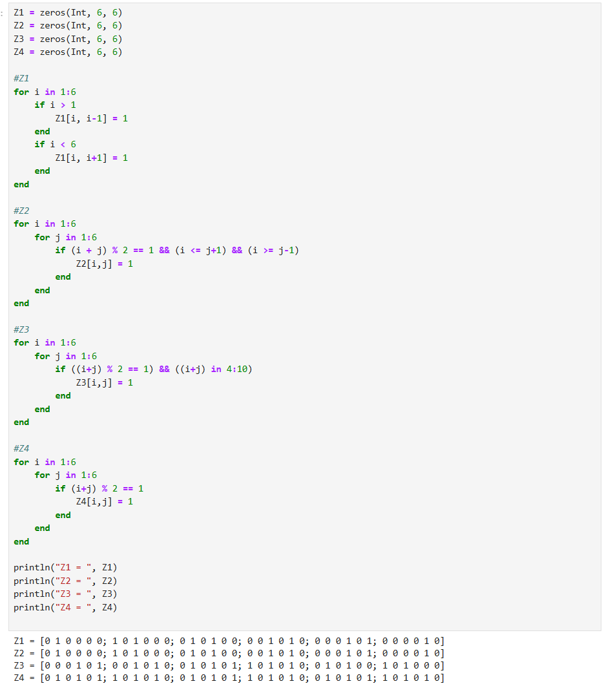{#fig:008 width=70%}

## 8.

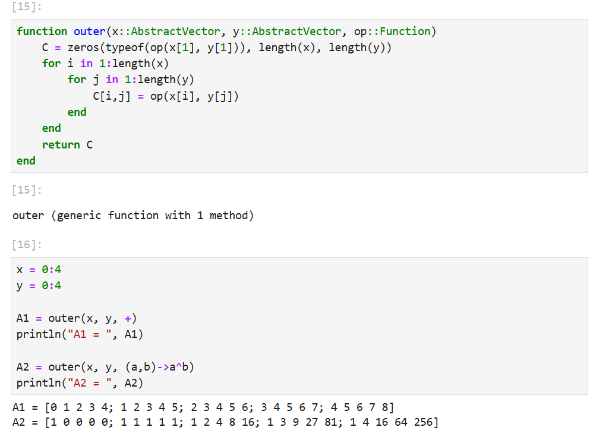{#fig:009 width=70%}

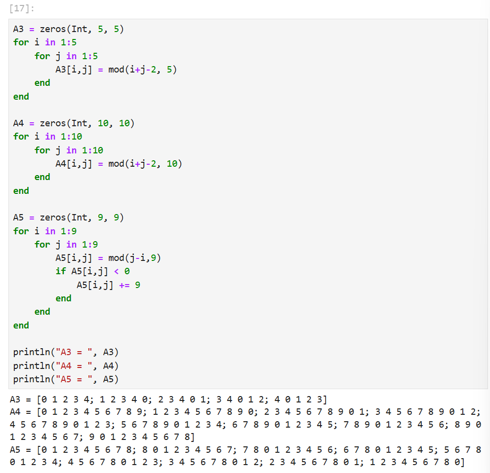{#fig:010 width=70%}

## 9.

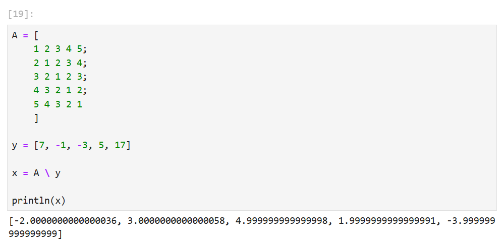{#fig:011 width=70%}

## 10.

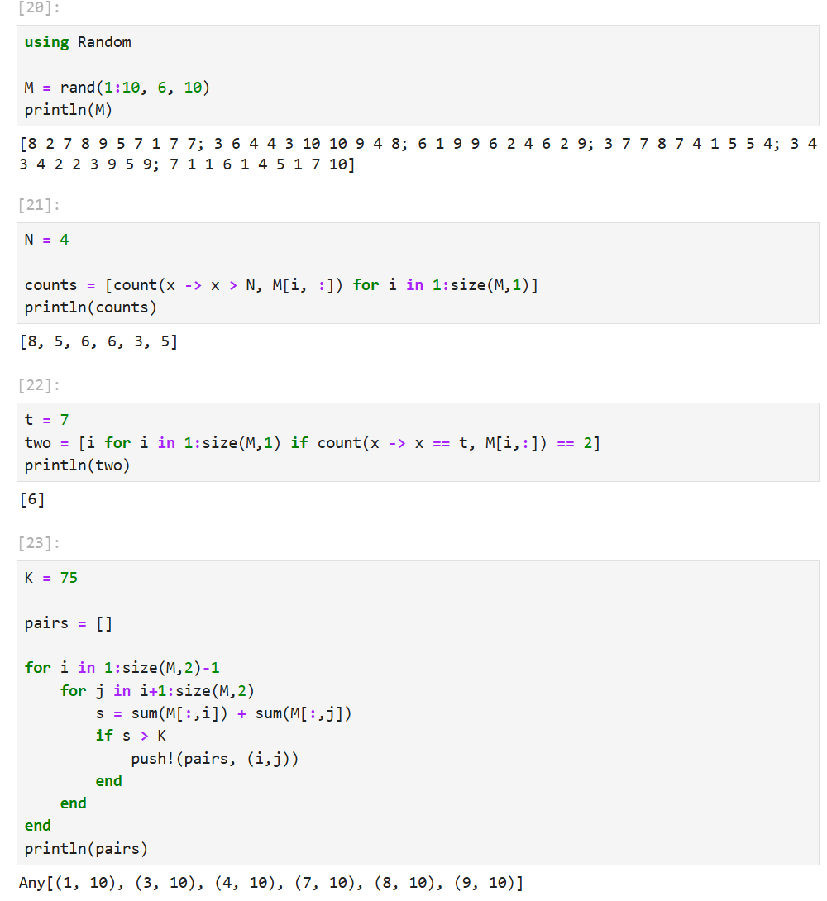{#fig:012 width=70%}

## Вывод

Я освоила применение циклов функций и сторонних для Julia пакетов для решения задач линейной алгебры и работы с матрицами.
