---
## Front matter
title: "Лабораторная работа №4"
subtitle: " Линейная алгебра"
author: "Барабанова Кристина"

## Generic options
lang: ru-RU
toc-title: "Содержание"

## Bibliography
bibliography: bib/cite.bib
csl: pandoc/csl/gost-r-7-0-5-2008-numeric.csl

## Pdf output format
toc: true
toc-depth: 2
lof: true
lot: false
fontsize: 12pt
linestretch: 1.5
papersize: a4
documentclass: scrreprt

## I18n polyglossia
polyglossia-lang:
  name: russian
  options:
    - spelling=modern
    - babelshorthands=true
polyglossia-otherlangs:
  name: english

## I18n babel
babel-lang: russian
babel-otherlangs: english

## Fonts
mainfont: DejaVu Serif
sansfont: DejaVu Sans
monofont: DejaVu Sans Mono
mainfontoptions: Ligatures=TeX
romanfontoptions: Ligatures=TeX
sansfontoptions: Ligatures=TeX,Scale=MatchLowercase
monofontoptions: Scale=MatchLowercase,Scale=0.9

## Biblatex
biblatex: true
biblio-style: "gost-numeric"
biblatexoptions:
  - parentracker=true
  - backend=biber
  - hyperref=auto
  - language=auto
  - autolang=other*
  - citestyle=gost-numeric

## Pandoc-crossref LaTeX customization
figureTitle: "Рис."
tableTitle: "Таблица"
listingTitle: "Листинг"
lofTitle: "Список иллюстраций"
lotTitle: "Список таблиц"
lolTitle: "Листинги"

## Misc options
indent: true
header-includes:
  - \usepackage{indentfirst}
  - \usepackage{float}
  - \floatplacement{figure}{H}
---

# Цель работы

Основной целью работы является изучение возможностей специализированных пакетов Julia для выполнения и оценки эффективности операций над объектами линейной алгебры.

# Задание

4.4.1. Произведение векторов
1. Задайте вектор v. Умножьте вектор v скалярно сам на себя и сохраните результат
в dot_v.
2. Умножьте v матрично на себя (внешнее произведение), присвоив результат переменной outer_v.

4.4.2. Системы линейных уравнений
1. Решить СЛАУ с двумя неизвестными.
2. Решить СЛАУ с тремя неизвестными.

4.4.3. Операции с матрицами
1. Приведите приведённые ниже матрицы к диагональному виду

3. Найдите собственные значения матрицы A

# Выполнение лабораторной работы

## 4.4.1

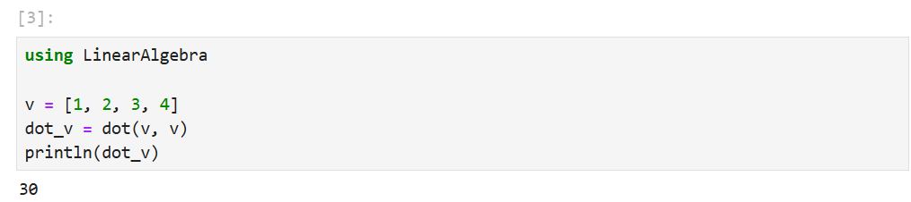{#fig:001 width=70%}

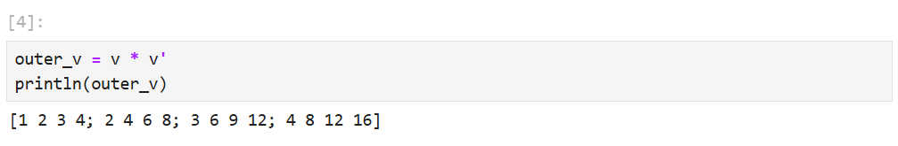{#fig:002 width=70%}

## 4.4.2

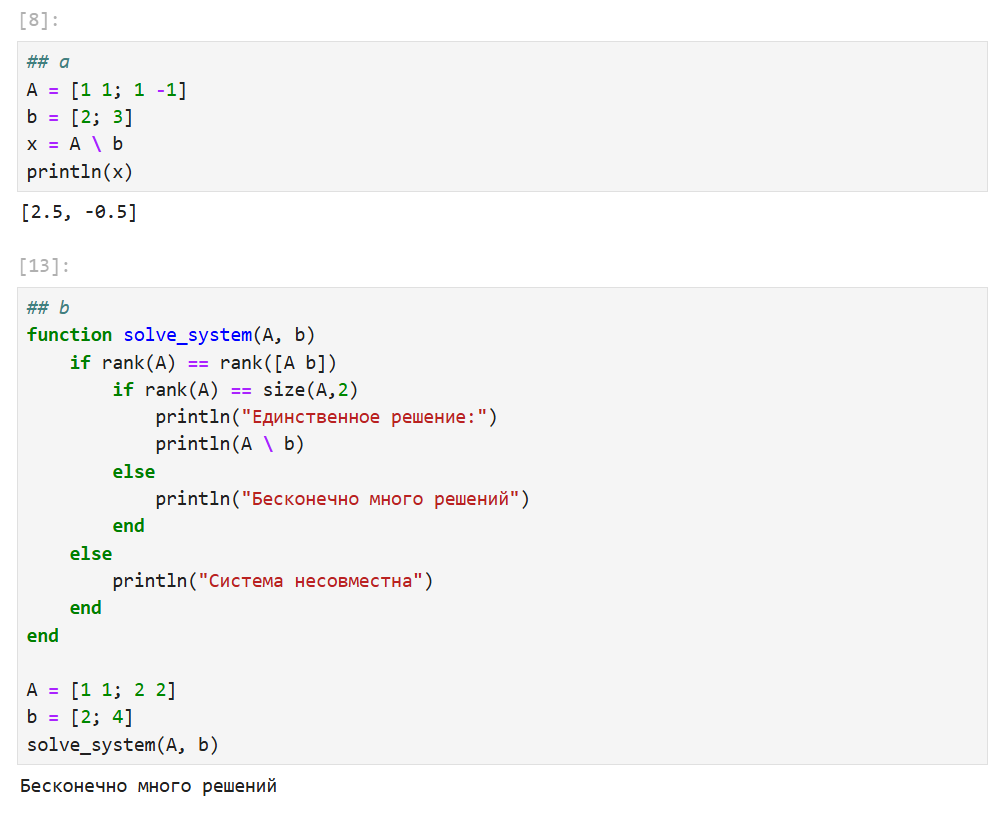{#fig:003 width=70%}

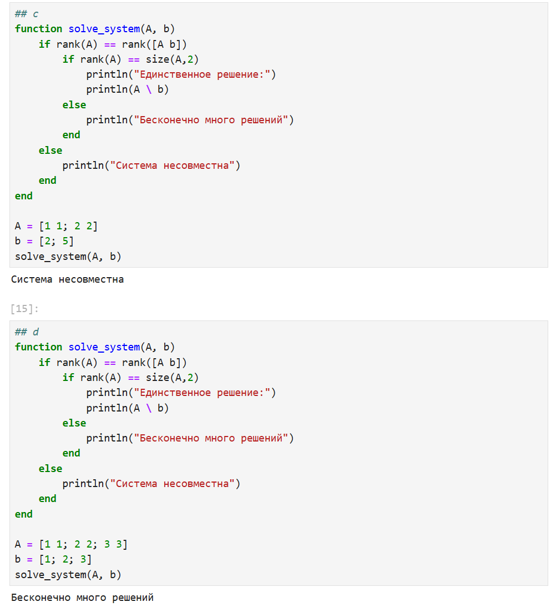{#fig:004 width=70%}

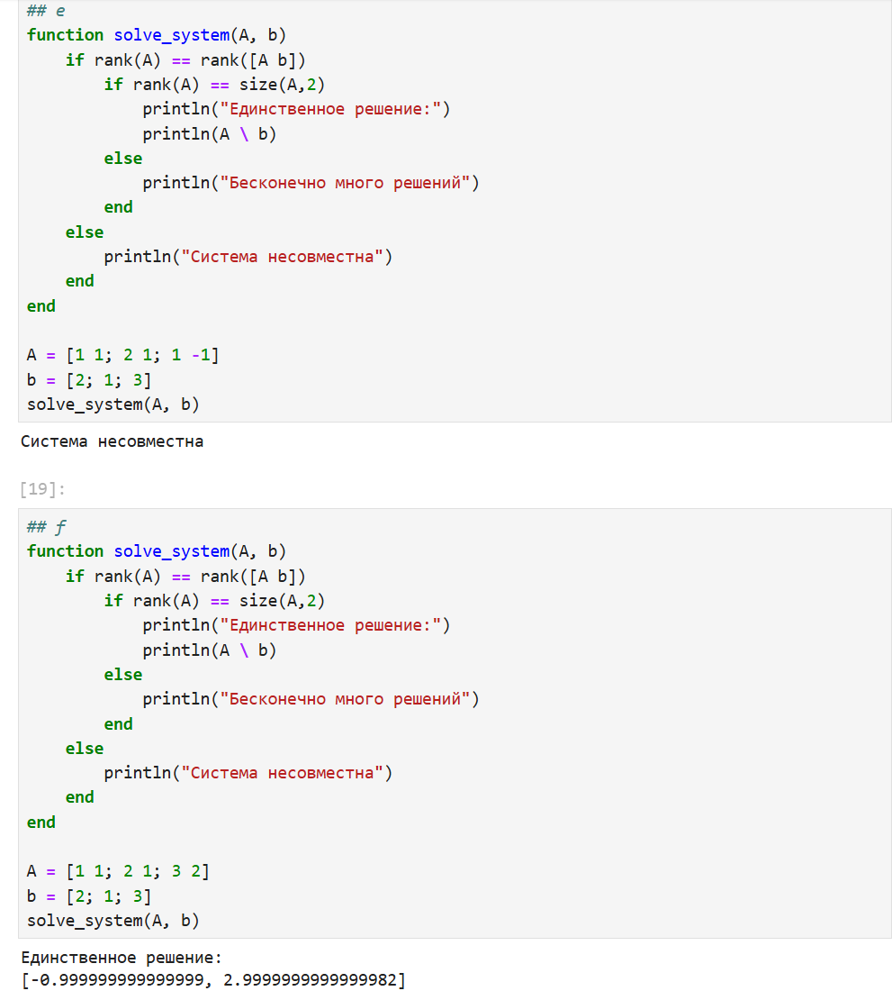{#fig:005 width=70%}

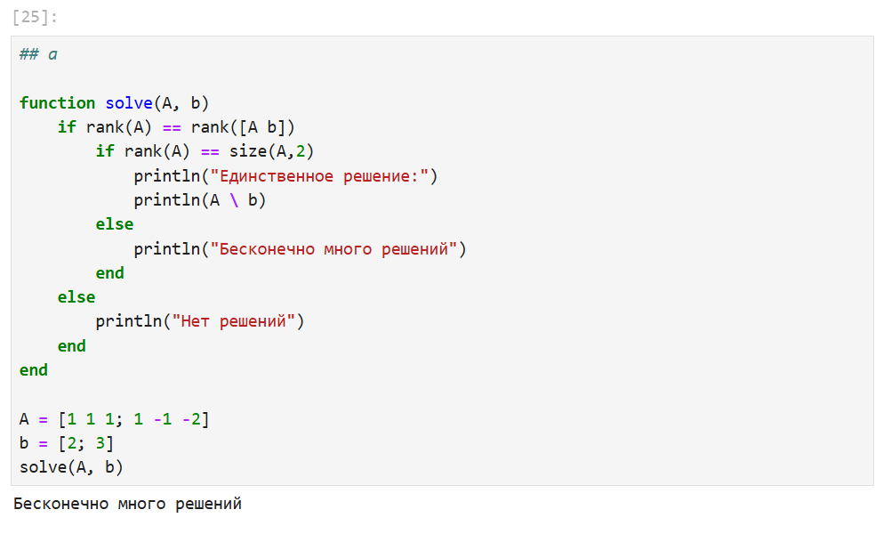{#fig:006 width=70%}

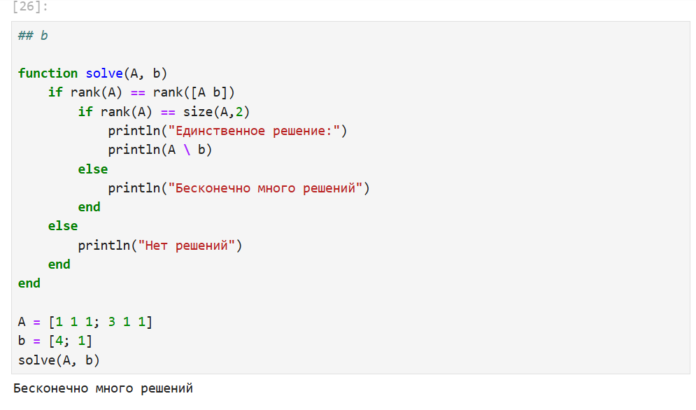{#fig:007 width=70%}

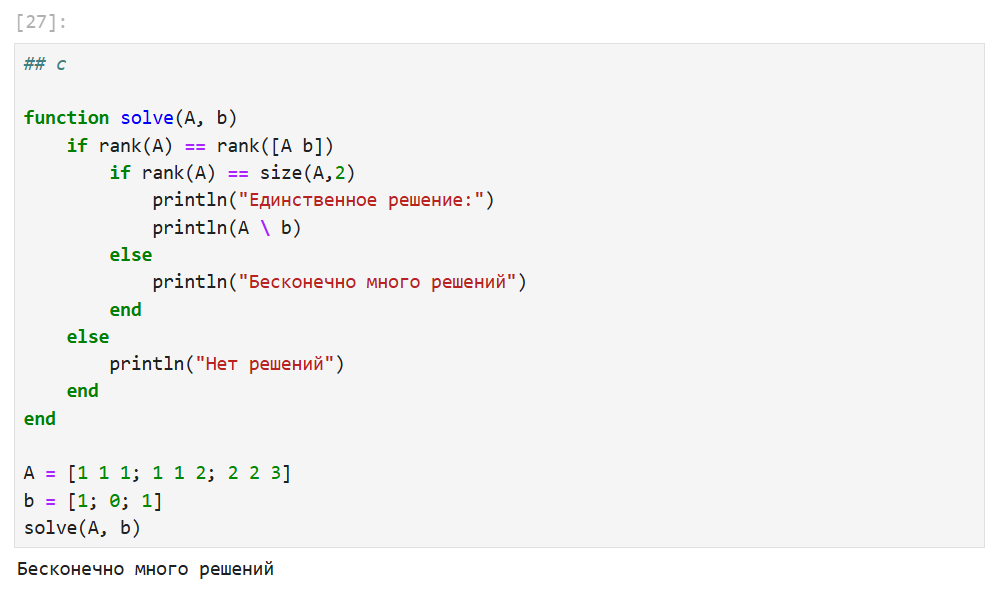{#fig:008 width=70%}

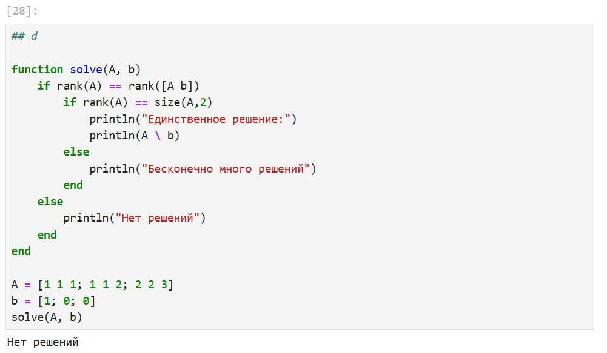{#fig:009 width=70%}

## 4.4.3

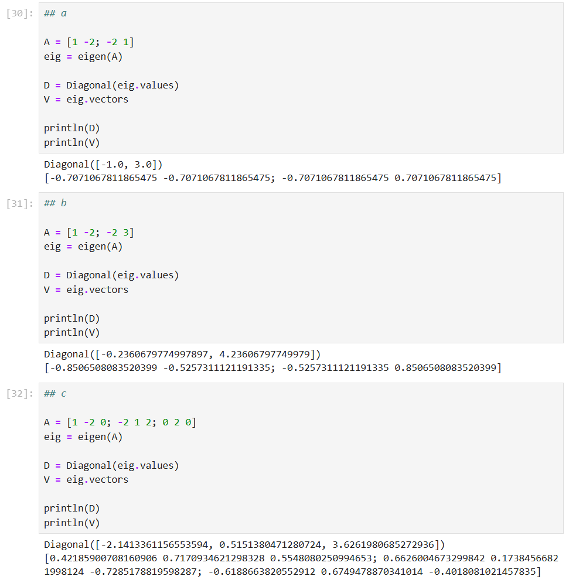{#fig:010 width=70%}

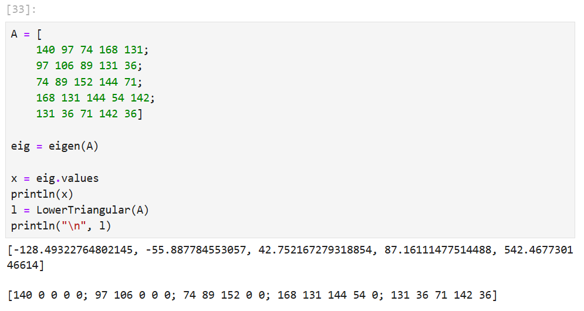{#fig:011 width=70%}

## Вывод

Я изучила возможности специализированных пакетов Julia для выполнения и оценки эффективности операций над объектами линейной алгебры.
