---
## Front matter
lang: ru-RU
title: Лабораторная работа 
subtitle:
author:
  - Барабанова Кристина 
institute:
  - Российский университет дружбы народов, Москва, Россия

## i18n babel
babel-lang: russian
babel-otherlangs: english

## Formatting pdf
toc: false
toc-title: Содержание
slide_level: 2
aspectratio: 169
section-titles: true

header-includes:
  - \usepackage{fontspec}
  - \setmainfont{DejaVu Serif}
  - \setsansfont{DejaVu Sans}
  - \setmonofont{DejaVu Sans Mono}
---

# Информация

## Докладчик

:::::::::::::: {.columns align=center}
::: {.column width="70%"}

  Барабанова Кристина, студент группы НФИбд-02-22

:::
::::::::::::::

## Цель работы

Основной целью работы является развёртывание в системе виртуализации
(например, в VirtualBox) mininet, знакомство с основными командами для работы с Mininet через командную строку и через графический интерфейс.

# Выполнение лабораторной работы

## Подключение к виртуальной машине

Залогинилась в виртуальной машине
Посмотрела адрес машины:

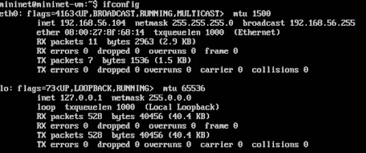{#fig:001 width=70%}

Подключилась к виртуальной машине (из терминала хостовой машины)

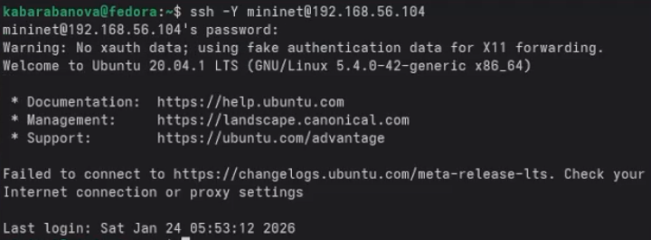{#fig:002 width=70%}

Отключила ssh-соединение с виртуальной машиной

{#fig:003 width=70%}

Настроила ssh-подсоединение по ключу к виртуальной машине

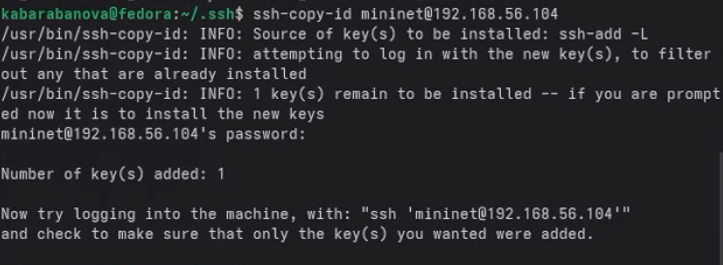{#fig:004 width=70%}

Вновь подключилась к виртуальной машине и убедилась, что подсоединение
происходит успешно и без ввода пароля.

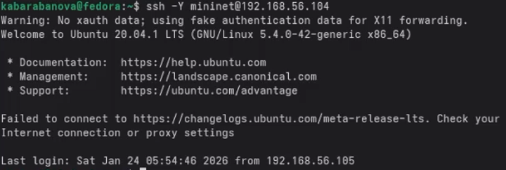{#fig:005 width=70%}

## Настройка доступа к Интернет

Активировала второй интерфейс

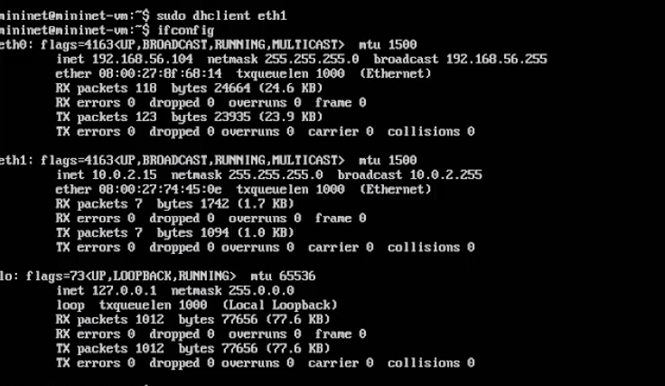{#fig:006 width=70%}

Для удобства дальнейшей работы установила mc

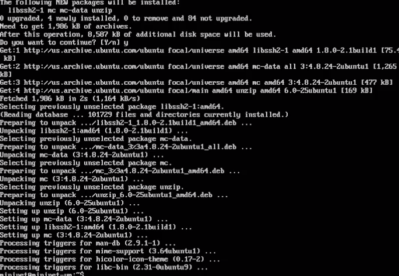{#fig:007 width=70%}

Для удобства дальнейшей работы добавьте для mininet указание на использование двух адаптеров при запуске. 

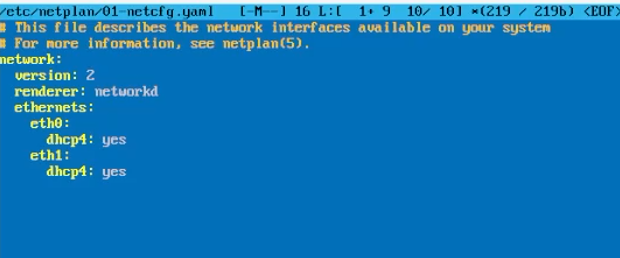{#fig:008 width=70%}

## Обновление версии Mininet

Скачала новую версию Mininet

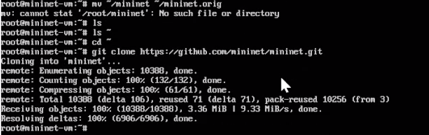{#fig:009 width=70%}

Обновила исполняемые файлы и проверила номер установленной версии mininet

{#fig:010 width=70%}

## Настройка параметров XTerm

По умолчанию XTerm использует растровые шрифты малого кегля. Для увеличения размера шрифта и применения векторных шрифтов вместо растровых
необходимо внести изменения в файл /etc/X11/app-defaults/XTerm. Для
этого можно воспользоваться следующей командой:
1 sudo mcedit /etc/X11/app-defaults/XTerm
и затем в конце файла добавить строки

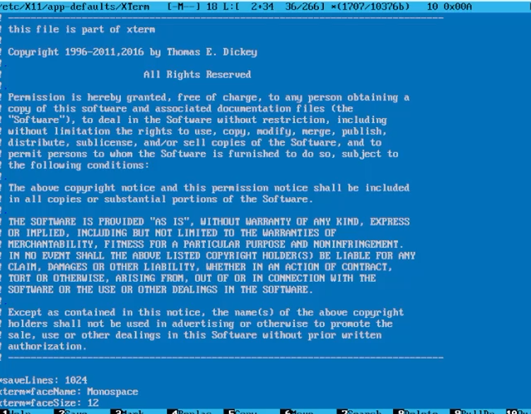{#fig:011 width=70%}

Здесь выбран системный моноширинный шрифт, кегль шрифта — 12 пунктов.

## Настройка соединения X11 для суперпользователя

При попытке запуска приложения из-под суперпользователя возникает ошибка:
X11 connection rejected because of wrong authentication.
Ошибка возникает из-за того, что X-соединение выполняется от имени пользователя mininet, а приложение запускается от имени пользователя root
с использованием sudo. Для исправления этой ситуации необходимо заполнить файл полномочий /root/.Xauthority, используя утилиту xauth.
Скопировала значение куки (MIT magic cookie)1 пользователя mininet в файл
для пользователя root:

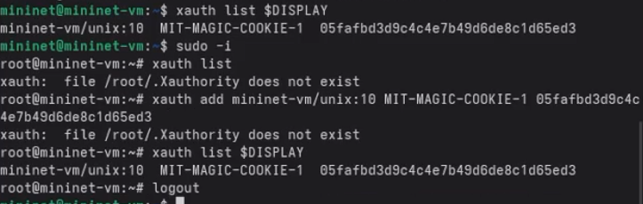{#fig:012 width=70%}

## Работа с Mininet из-под Windows

Установка программного обеспечения.

Установила putty:

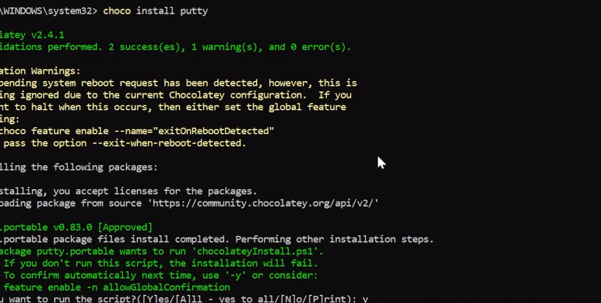{#fig:013 width=70%}

Установила VcXsrv Windows X Server

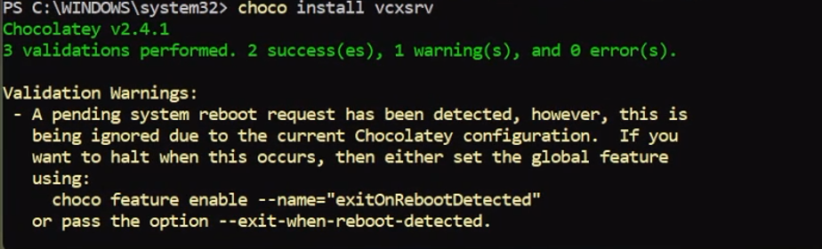{#fig:014 width=70%}

## 2. Основы работы в Mininet

## Работа с Mininet с помощью командной строки

Запустила Mininet с минимальной топологией, состоящей из
коммутатора, подключённого к двум хостам

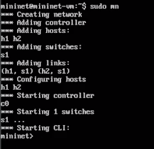{#fig:015 width=70%}

Для отображения списка команд интерфейса командной строки Mininet
и примеров их использования ввела команду в интерфейсе командной
строки Mininet

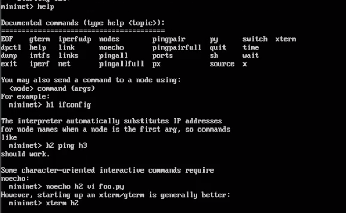{#fig:016 width=70%}

Для отображения доступных узлов ввела:

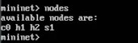{#fig:017 width=70%}

Ввела команду net в интерфейсе командной
строки Mininet, чтобы просмотреть доступные линки:

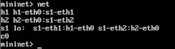{#fig:018 width=70%}

Вывод этой команды показывает:
– Хост h1 подключён через свой сетевой интерфейс h1-eth0 к коммутатору на интерфейсе s1-eth1.
– Хост h2 подключён через свой сетевой интерфейс h2-eth0 к коммутатору на интерфейсе s1-eth2.
– Коммутатор s1:
– имеет петлевой интерфейс lo.
– подключается к h1-eth0 через интерфейс s1-eth1.
– подключается к h2-eth0 через интерфейс s1-eth2.

Посмотрела конфигурацию всех узлов

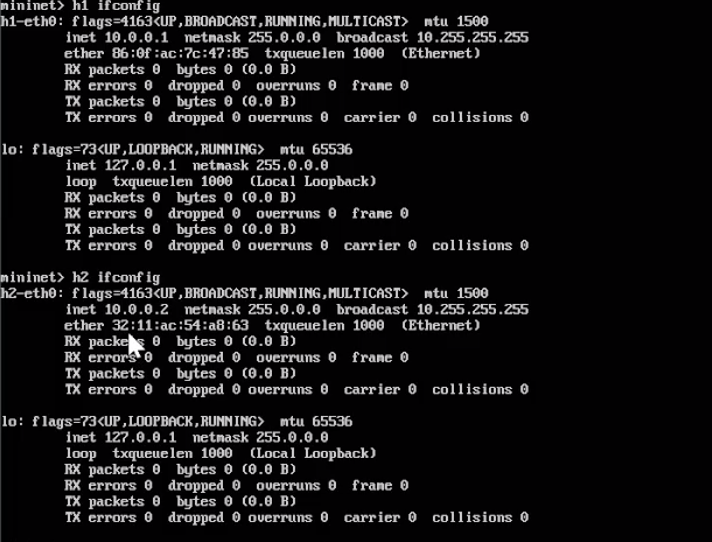{#fig:019 width=70%}

проверила соединение между хостами h1 и h2

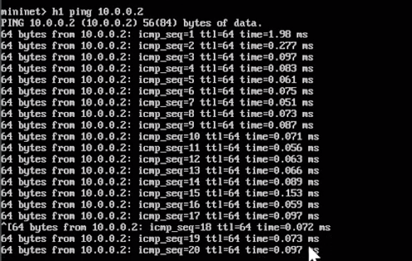{#fig:020 width=70%}

---

## 3. Построение и эмуляция сети в Mininet с использованием графического интерфейса

В терминале виртуальной машины mininet запустила MiniEdit:

{#fig:021 width=70%}

Добавила два хоста и один коммутатор, соединила хосты с коммутатором

Настроила IP-адреса на хостах h1 и h2. Для хоста h1 указала IP-адрес
10.0.0.1/8, а для хоста h2 — 10.0.0.2/8.

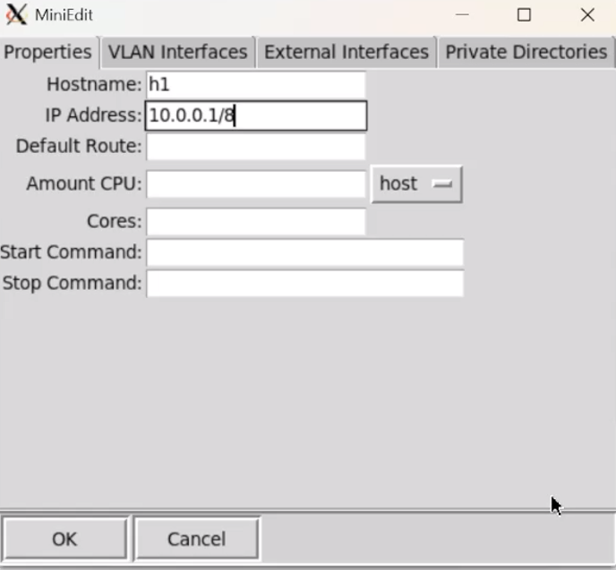{#fig:022 width=70%}
{#fig:023 width=70%}

Перед проверкой соединения между хостом h1 и хостом h2 необходимо
запустить эмуляцию. Для запуска эмуляции нажала кнопку Run. После
начала эмуляции кнопки панели MiniEdit стали серыми, указывая на то,
что в настоящее время они отключены.

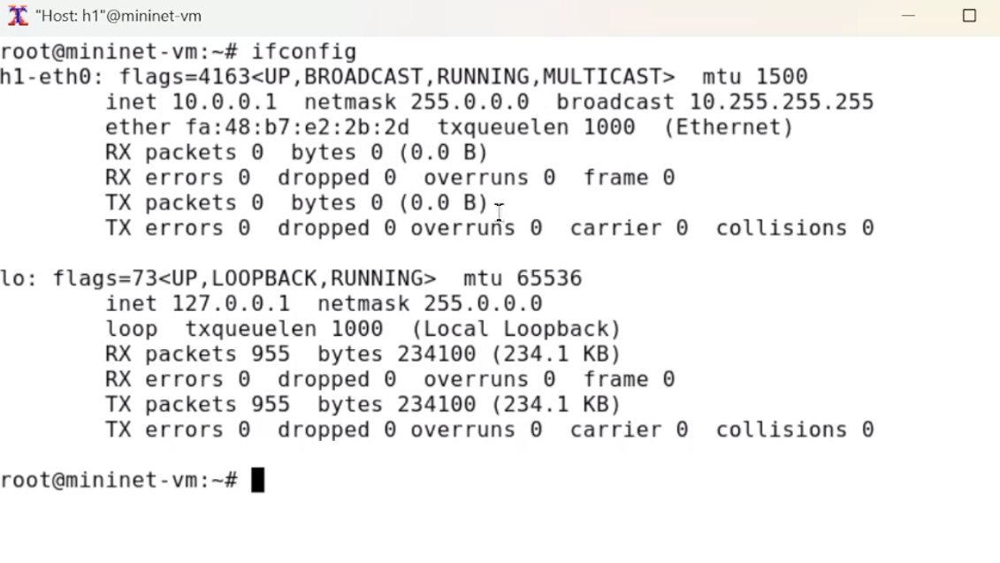{#fig:024 width=70%}
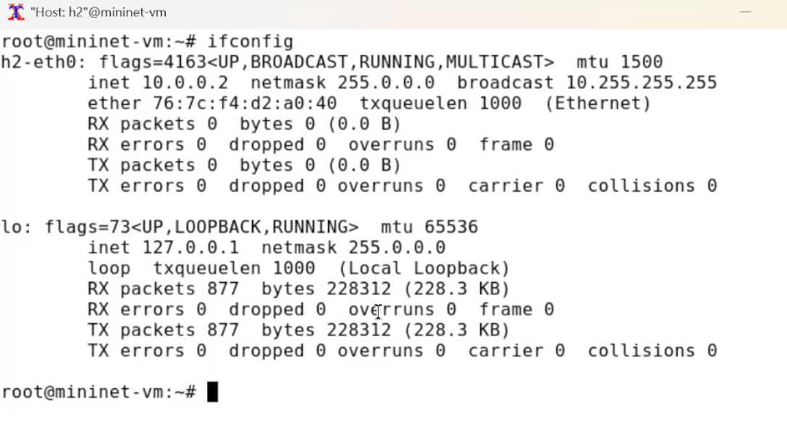{#fig:025 width=70%}

Проверила соединение между хостами, введя в терминале хоста h1 команду
ping 10.0.0.2. 

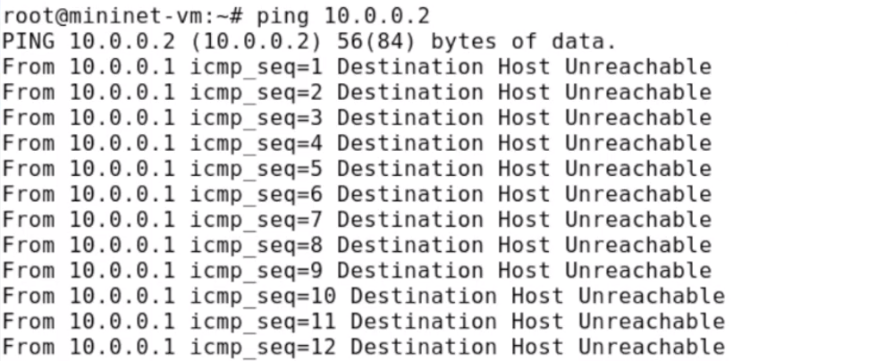{#fig:026 width=70%}

Ранее IP-адреса узлам h1 и h2 были назначены вручную. В качестве альтернативы можно полагаться на Mininet для автоматического назначения
IP-адресов.

– Проверила IP-адреса хостов h1 и h2.

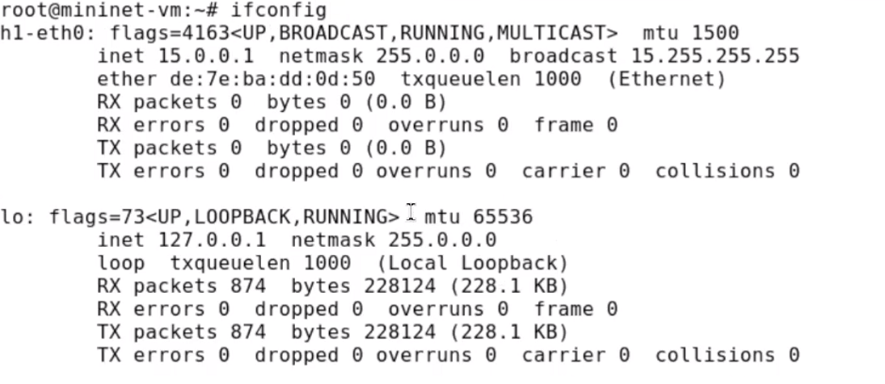{#fig:027 width=70%}
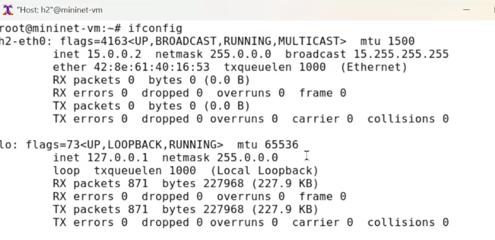{#fig:028 width=70%}

В домашнем каталоге виртуальной машины mininet создала каталог для
работы с проектами mininet:

{#fig:029 width=70%}

После сохранения проекта поменяла права доступа к файлам в каталоге
проекта:

{#fig:030 width=70%}

## Выводы

Я осуществила развёртывание в системе виртуализации mininet, познакомилась с основными командами для работы с Mininet через командную строку и через графический интерфейс.

