---
## Front matter
lang: ru-RU
title: Лабораторная работа №4
subtitle: Эмуляция и измерение задержек в глобальных сетях
author:
  - Барабанова Кристина
institute:
  - Российский университет дружбы народов, Москва, Россия

## i18n babel
babel-lang: russian
babel-otherlangs: english

## Formatting pdf
toc: false
toc-title: Содержание
slide_level: 2
aspectratio: 169
section-titles: true

header-includes:
  - \usepackage{fontspec}
  - \setmainfont{DejaVu Serif}
  - \setsansfont{DejaVu Sans}
  - \setmonofont{DejaVu Sans Mono}
---

# Информация

## Докладчик

:::::::::::::: {.columns align=center}
::: {.column width="70%"}
Барабанова Кристина, студент группы НФИбд-02-22
  

:::
::::::::::::::

## Цель работы

Основной целью работы является знакомство с NETEM — инструментом для
тестирования производительности приложений в виртуальной сети, а также
получение навыков проведения интерактивного и воспроизводимого экспериментов по измерению задержки и её дрожания (jitter) в моделируемой сети
в среде Mininet.

## Задание

1. Задайте простейшую топологию, состоящую из двух хостов и коммутатора
с назначенной по умолчанию mininet сетью 10.0.0.0/8.
2. Проведите интерактивные эксперименты по добавлению/изменению задержки, джиттера, значения корреляции для джиттера и задержки, распределения
времени задержки в эмулируемой глобальной сети.
3. Реализуйте воспроизводимый эксперимент по заданию значения задержки
в эмулируемой глобальной сети. Постройте график.
4. Самостоятельно реализуйте воспроизводимые эксперименты по изменению
задержки, джиттера, значения корреляции для джиттера и задержки, распределения времени задержки в эмулируемой глобальной сети. Постройте
графики.

# Выполнение лабораторной работы

# 1. Запуск лабораторной топологии

Запустите виртуальную среду с mininet.
Из основной ОС подключитесь к виртуальной машине:

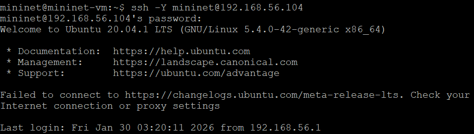{#fig:001 width=60%}

## 

В виртуальной машине mininet при необходимости исправьте права запуска
X-соединения. Скопируйте значение куки (MIT magic cookie)1
своего пользователя mininet в файл для пользователя root:

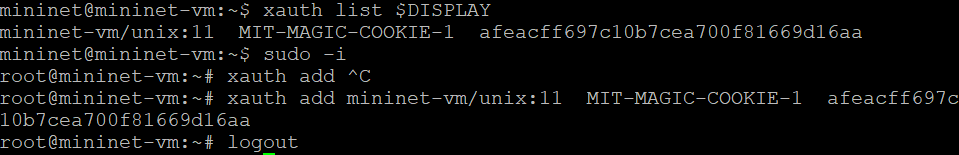{#fig:002 width=60%}

## 

Задайте простейшую топологию, состоящую из двух хостов и коммутатора
с назначенной по умолчанию mininet сетью 10.0.0.0/8:

После введения этой команды запустятся терминалы двух хостов, коммутатора и контроллера. 

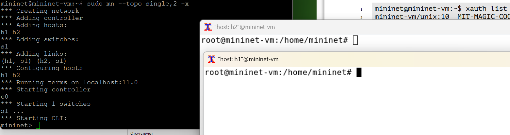{#fig:003 width=60%}

## 

На хостах h1 и h2 введите команду ifconfig, чтобы отобразить информацию, относящуюся к их сетевым интерфейсам и назначенным им IP-адресам

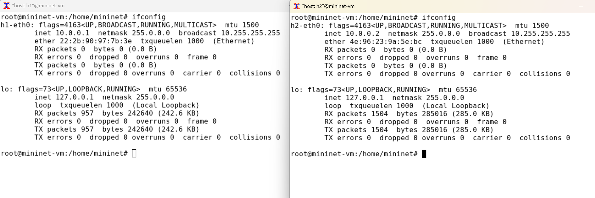{#fig:004 width=60%}

## 

Проверьте подключение между хостами h1 и h2 с помощью команды ping с параметром -c 6

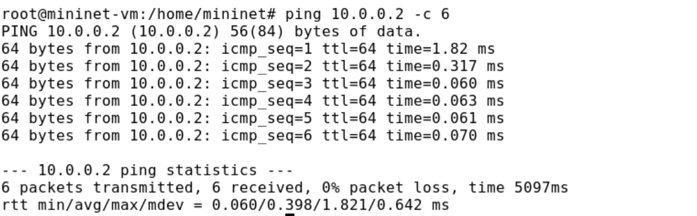{#fig:005 width=60%}

RTT: 0.060/0.398/1.821/0.642 ms

# 2. Интерактивные эксперименты

## Добавление/изменение задержки в эмулируемой глобальной сети

Сетевые эмуляторы задают задержки на интерфейсе. Например, задержка, вносимая в интерфейс коммутатора A, который подключён к интерфейсу коммутатора B, может представлять собой задержку распространения WAN, соединяющей оба коммутатора.

1. На хосте h1 добавьте задержку в 100 мс к выходному интерфейсу:

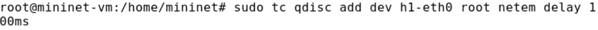{#fig:006 width=60%}

## 

2. Проверьте, что соединение от хоста h1 к хосту h2 имеет задержку 100 мс, используя команду ping с параметром -c 6 с хоста h1. Укажите в отчёте минимальное, среднее, максимальное и стандартное отклонение времени приёма-передачи (RTT).

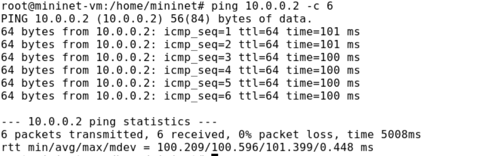{#fig:007 width=60%}

RTT: 100.209/100.596/101.399/0.448

## 

3. Для эмуляции глобальной сети с двунаправленной задержкой необходимо к соответствующему интерфейсу на хосте h2 также добавить задержку в 100 миллисекунд:

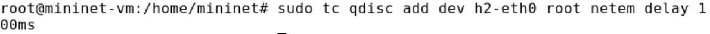{#fig:008 width=60%}

## 

4. Проверьте, что соединение между хостом h1 и хостом h2 имеет RTT в 200 мс
(100 мс от хоста h1 к хосту h2 и 100 мс от хоста h2 к хосту h1), повторив
команду ping с параметром -c 6 на терминале хоста h1. Укажите в отчёте
минимальное, среднее, максимальное и стандартное отклонение времени
приёма-передачи (RTT).

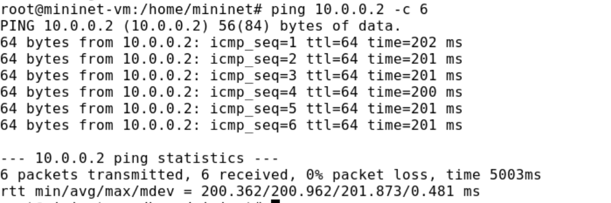{#fig:009 width=60%}

RTT: 200.362/200.962/201.873/0.481

## Изменение задержки в эмулируемой глобальной сети

1. Измените задержку со 100 мс до 50 мс для отправителя h1:

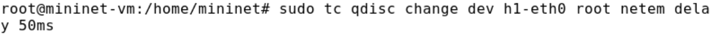{#fig:010 width=50%}

и для получателя h2:

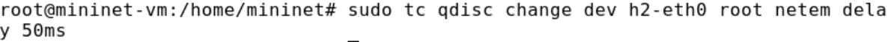{#fig:011 width=50%}

##

2. Проверьте, что соединение от хоста h1 к хосту h2 имеет задержку 100 мс, используя команду ping с параметром -c 6 с терминала хоста h1. Укажите в отчёте минимальное, среднее, максимальное и стандартное отклонение времени приёма-передачи (RTT).

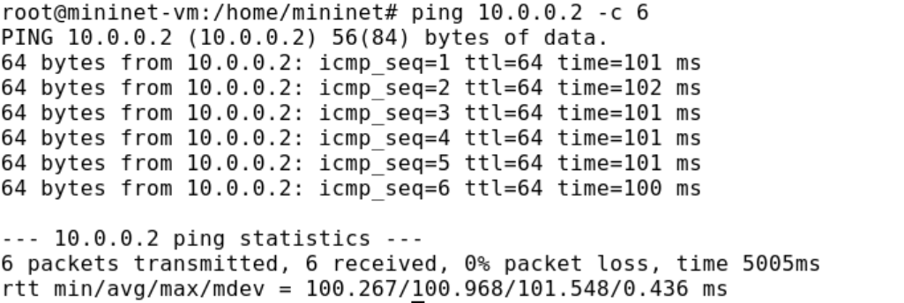{#fig:012 width=60%}

RTT: 100.267/100.968/101.548/0.436

##  Восстановление исходных значений (удаление правил) задержки в эмулируемой глобальной сети

1. Восстановите конфигурацию по умолчанию, удалив все правила, применённые к сетевому планировщику соответствующего интерфейса. Для
отправителя h1:

{#fig:013 width=50%}

Для получателя h2:

{#fig:014 width=50%}

##

2. Проверьте, что соединение между хостом h1 и хостом h2 не имеет явно утановленной задержки, используя команду ping с параметром -c 6 с терминала хоста h1. Укажите в отчёте минимальное, среднее, максимальное и стандартное отклонение времени приёма-передачи (RTT).

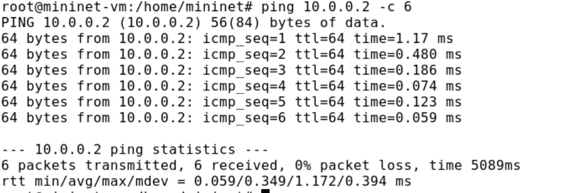{#fig:015 width=60%}

RTT: 0.059/0.349/1.172/0.394 ms

##  Добавление значения дрожания задержки в интерфейс подключения к эмулируемой глобальной сети

2. Добавьте на узле h1 задержку в 100 мс со случайным отклонением 10 мс:

3. Проверьте, что соединение от хоста h1 к хосту h2 имеет задержку 100 мс со случайным отклонением ±10 мс, используя в терминале хоста h1 команду ping с параметром -c 6. Укажите в отчёте минимальное, среднее, максимальное и стандартное отклонение времени приёма-передачи (RTT).

4. Восстановите конфигурацию интерфейса по умолчанию на узле h1.

##

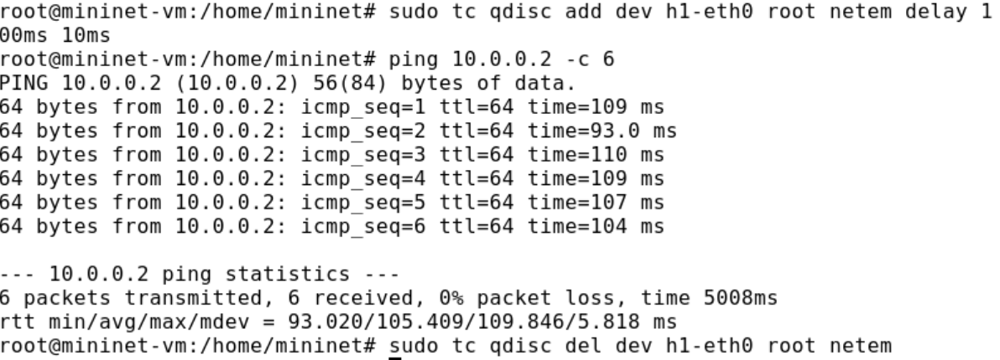{#fig:016 width=50%}

## Добавление значения корреляции для джиттера и задержки в интерфейс подключения к эмулируемой глобальной сети

1. При необходимости восстановите конфигурацию интерфейсов по умолчанию на узлах h1 и h2.
2. Добавьте на интерфейсе хоста h1 задержку в 100 мс с вариацией ±10 мс и значением корреляции в 25%:

3. Убедитесь, что все пакеты, покидающие устройство h1 на интерфейсе h1-
eth0, будут иметь время задержки 100 мс со случайным отклонением ±10 мс, при этом время передачи следующего пакета зависит от предыдущего значения на 25%. Используйте для этого в терминале хоста h1 команду ping с параметром -c 20. Укажите в отчёте минимальное, среднее, максимальное и стандартное отклонение времени приёма-передачи (RTT).

##

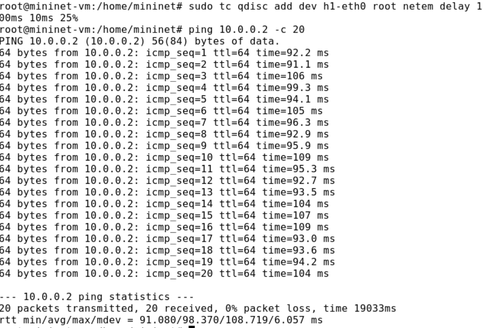{#fig:017 width=50%}

## Распределение задержки в интерфейсе подключения к эмулируемой глобальной сети

1. При необходимости восстановите конфигурацию интерфейсов по умолчанию
на узлах h1 и h2.
2. Задайте нормальное распределение задержки на узле h1 в эмулируемой сети:

3. Убедитесь, что все пакеты, покидающие хост h1 на интерфейсе h1-eth0, будут иметь время задержки, которое распределено в диапазоне 100 мс ±20 мс.

##

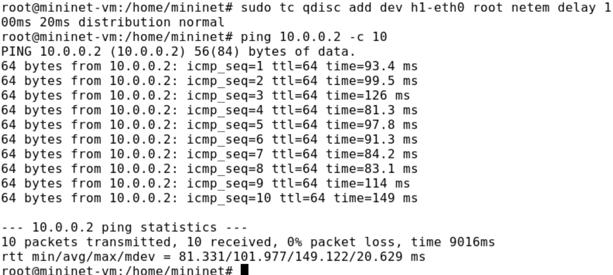{#fig:018 width=60%}

4. Восстановите конфигурацию интерфейса по умолчанию на узле h1.
5. Завершите работу mininet в интерактивном режиме.

# 3. Воспроизведение экспериментов

## Предварительная подготовка

1. Обновите репозитории программного обеспечения на виртуальной машине: 

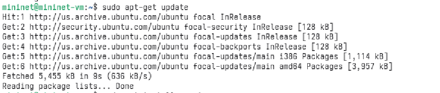{#fig:019 width=60%}

##

2. Установите пакет geeqie — понадобится для просмотра файлов png:

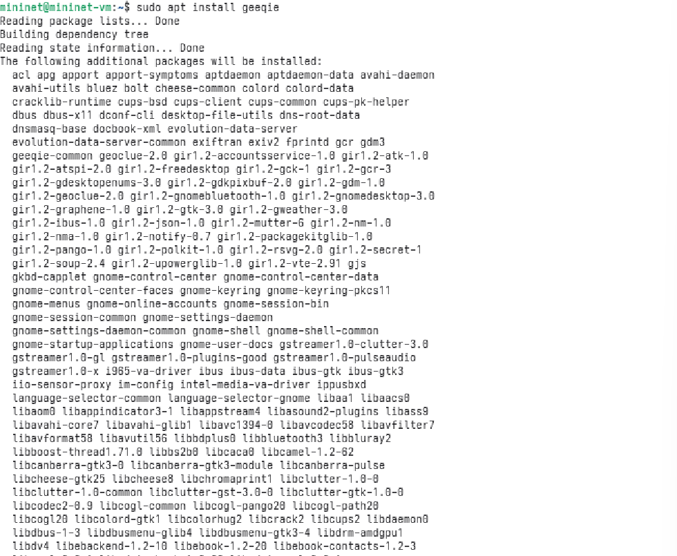{#fig:020 width=60%}

##

3. Для каждого воспроизводимого эксперимента expname создайте свой каталог, в котором будут размещаться файлы эксперимента:

{#fig:021 width=60%}

## Добавление задержки для интерфейса, подключающегося к  эмулируемой глобальной сети

1. В виртуальной среде mininet в своём рабочем каталоге с проектами создайте
каталог simple-delay и перейдите в него.

2. Создаёте скрипт для эксперимента lab_netem_i.py:

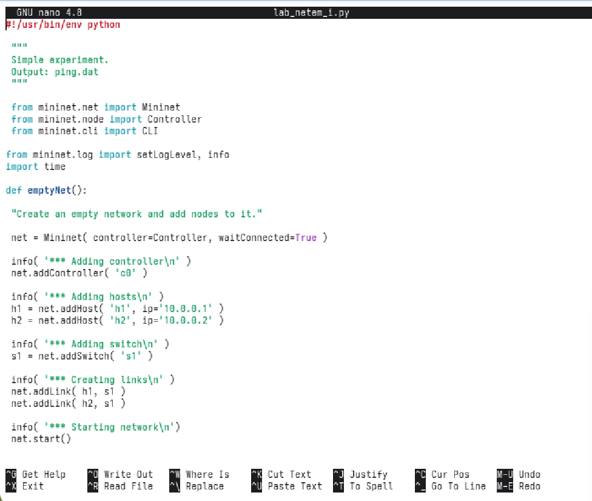{#fig:022 width=60%}

##

4. Создаёте скрипт для визуализации ping_plot результатов эксперимента.

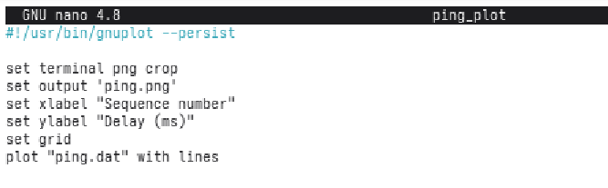{#fig:023 width=60%}

##

5. Задайте права доступа к файлу скрипта:

{#fig:024 width=60%}

##

6. Создайте Makefile для управления процессом проведения эксперимента:

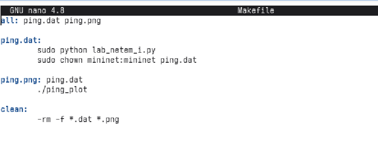{#fig:025 width=60%}

##

7. Выполните эксперимент:

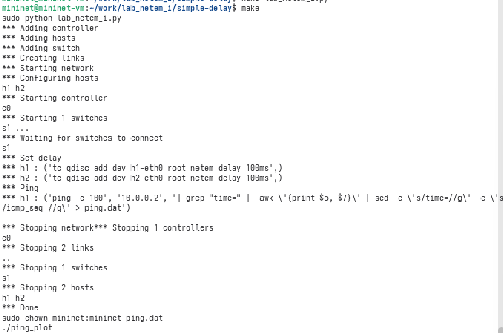{#fig:026 width=60%}

##

9. Из файла ping.dat удалите первую строку и заново постройте график:

{#fig:027 width=60%}

##

10. Продемонстрируйте построенный в результате график

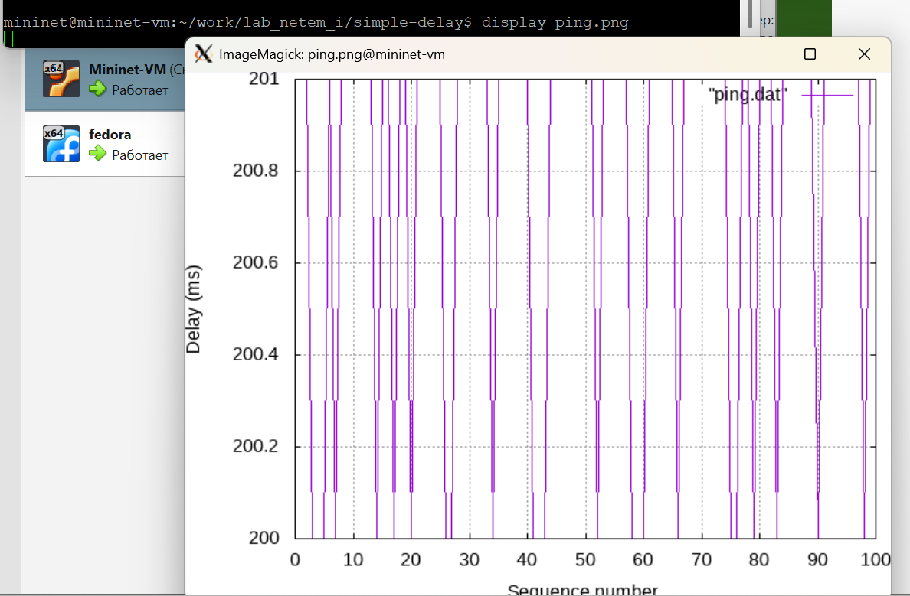{#fig:028 width=60%}

##

11. Разработайте скрипт для вычисления на основе данных файла ping.dat минимального, среднего, максимального и стандартного отклонения времени приёма-передачи.

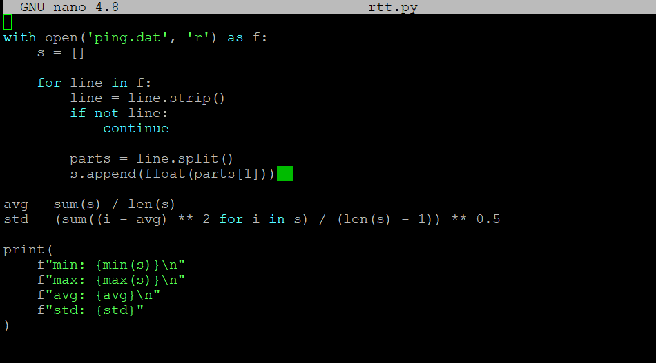{#fig:029 width=60%}

##

12. Очистите каталог от результатов проведения экспериментов:

{#fig:030 width=60%}

## Вывод

Я познакомилась с NETEM — инструментом для
тестирования производительности приложений в виртуальной сети, а также получила навыки проведения интерактивного и воспроизводимого экспериментов по измерению задержки и её дрожания (jitter) в моделируемой сети в среде Mininet.

