---
## Front matter
lang: ru-RU
title: Лабораторная работа №5
subtitle: Эмуляция и измерение потерь пакетов в глобальных сетях
author:
  - Барабанова Кристина
institute:
  - Российский университет дружбы народов, Москва, Россия

## i18n babel
babel-lang: russian
babel-otherlangs: english

## Formatting pdf
toc: false
toc-title: Содержание
slide_level: 2
aspectratio: 169
section-titles: true

header-includes:
  - \usepackage{fontspec}
  - \setmainfont{DejaVu Serif}
  - \setsansfont{DejaVu Sans}
  - \setmonofont{DejaVu Sans Mono}
---

## Цель работы

Основной целью работы является получение навыков проведения интерактивных экспериментов в среде Mininet по исследованию параметров сети,
связанных с потерей, дублированием, изменением порядка и повреждением
пакетов при передаче данных. Эти параметры влияют на производительность
протоколов и сетей.

## Задание

1. Задайте простейшую топологию, состоящую из двух хостов и коммутатора
с назначенной по умолчанию mininet сетью 10.0.0.0/8.
2. Проведите интерактивные эксперименты по по исследованию параметров
сети, связанных с потерей, дублированием, изменением порядка и повреждением пакетов при передаче данных.
3. Реализуйте воспроизводимый эксперимент по добавлению правила отбрасывания пакетов в эмулируемой глобальной сети. На экран выведите сводную
информацию о потерянных пакетах.
4. Самостоятельно реализуйте воспроизводимые эксперименты по исследованию параметров сети, связанных с потерей, изменением порядка и повреждением пакетов при передаче данных. На экран выведите сводную информацию о потерянных пакетах.

# Выполнение лабораторной работы

## 1. Запуск лабораторной топологии

1. Запустите виртуальную среду с mininet.
2. Из основной ОС подключитесь к виртуальной машине:

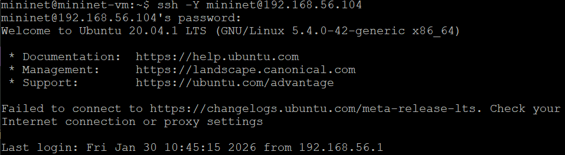{#fig:001 width=70%}

## 

3. В виртуальной машине mininet при необходимости исправьте права запуска
X-соединения. Скопируйте значение куки (MIT magic cookie)1
своего пользователя mininet в файл для пользователя root:

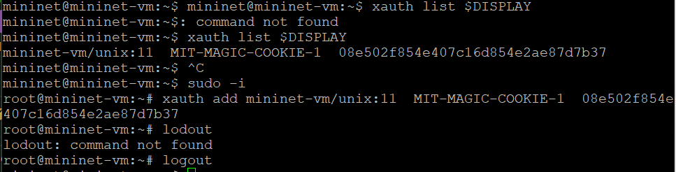{#fig:002 width=70%}

##

4. Задайте простейшую топологию, состоящую из двух хостов и коммутатора
с назначенной по умолчанию mininet сетью 10.0.0.0/8:

{#fig:003 width=70%}

## 

5. На хостах h1 и h2 введите команду ifconfig, чтобы отобразить информацию, относящуюся к их сетевым интерфейсам и назначенным им IP-адресам

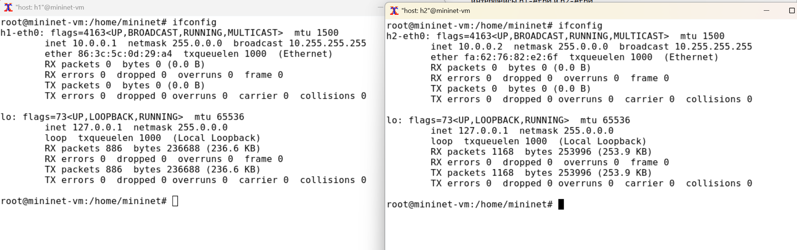{#fig:004 width=70%}

## 

6. Проверьте подключение между хостами h1 и h2 с помощью команды ping
с параметром -c 6.

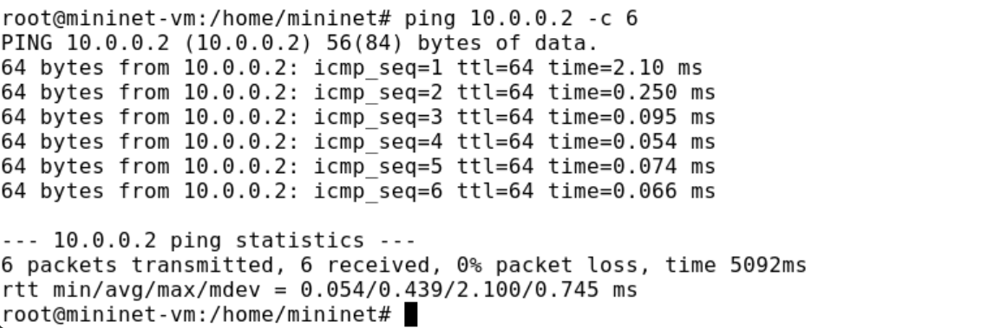{#fig:005 width=70%}

## 2. Добавление потери пакетов на интерфейс, подключённый к эмулируемой глобальной сети

1. На хосте h1 добавьте 10% потерь пакетов к интерфейсу h1-eth0:

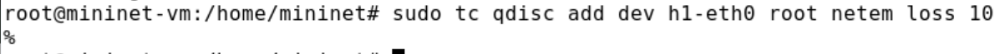{#fig:006 width=70%}

## 

2. Проверьте, что на соединении от хоста h1 к хосту h2 имеются потери пакетов, используя команду ping с параметром -c 100 с хоста h1. Параметр -c
указывает общее количество пакетов для отправки. 

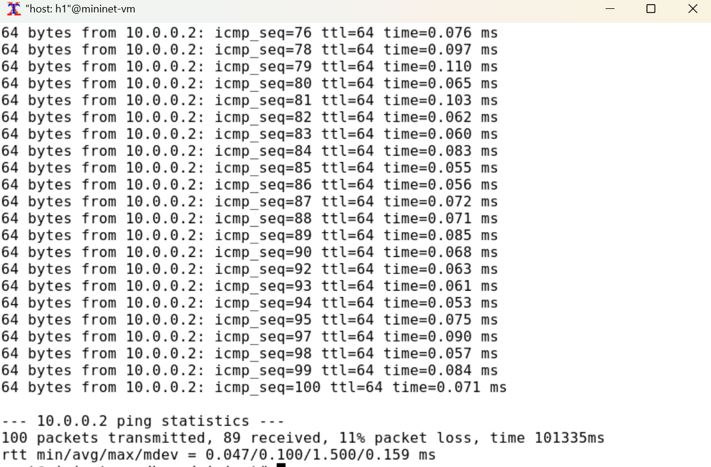{#fig:007 width=70%}

##

3. Для эмуляции глобальной сети с потерей пакетов в обоих направлениях
необходимо к соответствующему интерфейсу на хосте h2 также добавить 10%
потерь пакетов:

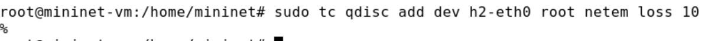{#fig:008 width=70%}

##

4. Проверьте, что соединение между хостом h1 и хостом h2 имеет больший процент потерянных данных (10% от хоста h1 к хосту h2 и 10% от хоста h2 к хосту
h1), повторив команду ping с параметром -c 100 на терминале хоста h1.

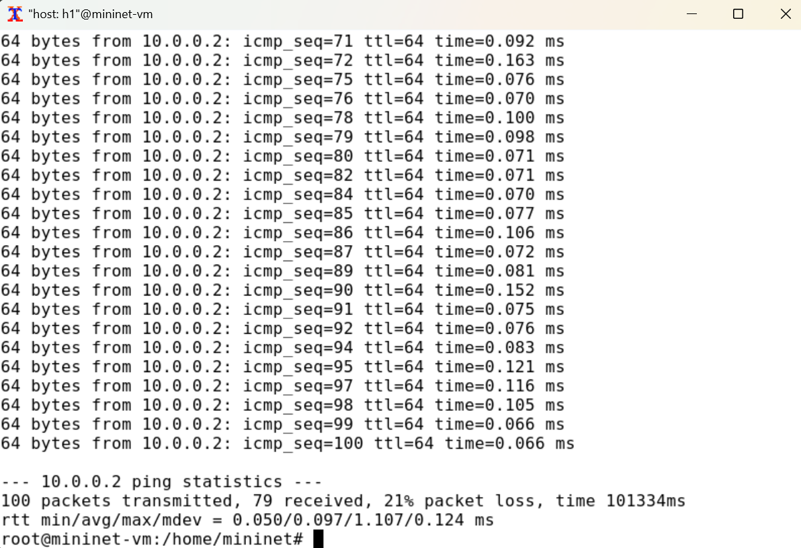{#fig:009 width=70%}

##

5. Восстановите конфигурацию по умолчанию, удалив все правила, применённые к сетевому планировщику соответствующего интерфейса. Для
отправителя h1:

{#fig:010 width=70%}

Для получателя h2:

{#fig:011 width=70%}

##

6. Убедитесь, что соединение от хоста h1 к хосту h2 не имеет явной потери
пакетов, запустив команду ping с терминала хоста h1

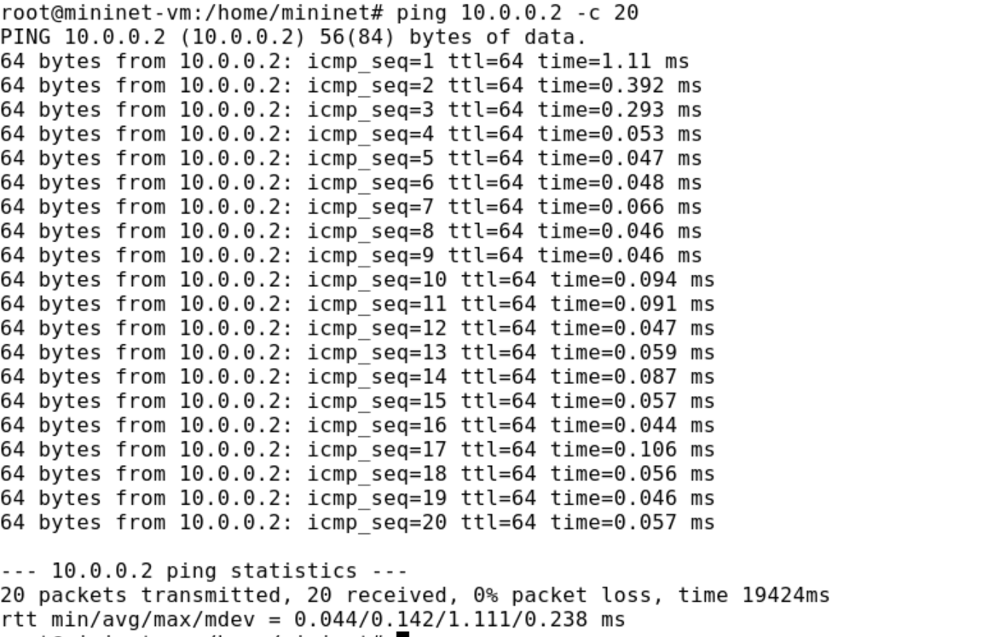{#fig:012 width=70%}

## 3. Добавление значения корреляции для потери пакетов в эмулируемой глобальной сети

1. Добавьте на интерфейсе узла h1 коэффициент потери пакетов 50% (такой
высокий уровень потери пакетов маловероятен), и каждая последующая
вероятность зависит на 50% от последней:

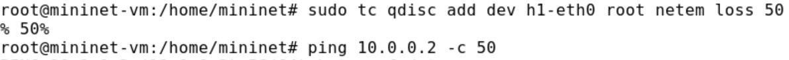{#fig:013 width=70%}

##

2. Проверьте, что на соединении от хоста h1 к хосту h2 имеются потери пакетов,
используя команду ping с параметром -c 50 с хоста h1.

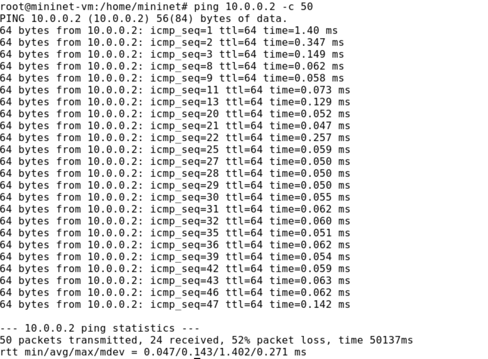{#fig:014 width=70%}

3. Восстановите для узла h1 конфигурацию по умолчанию, удалив все правила,
применённые к сетевому планировщику соответствующего интерфейса

## 4. Добавление повреждения пакетов в эмулируемой глобальной сети

1. При необходимости восстановите конфигурацию интерфейсов по умолчанию
на узлах h1 и h2.
2. Добавьте на интерфейсе узла h1 0,01% повреждения пакетов:

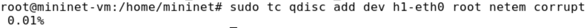{#fig:015 width=70%}

##

3. Проверьте конфигурацию с помощью инструмента iPerf3 для проверки
повторных передач. Для этого:
– запустите iPerf3 в режиме сервера в терминале хоста h2:

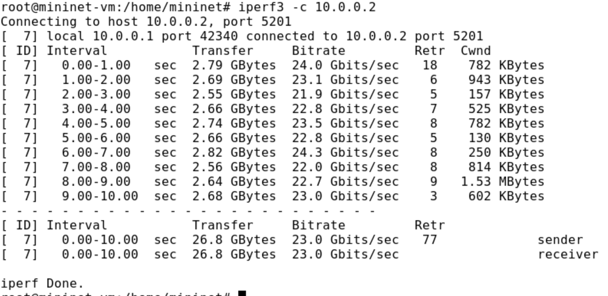{#fig:016 width=70%}

– запустите iPerf3 в клиентском режиме в терминале хоста h1:

{#fig:017 width=70%}

## 5.  Добавление переупорядочивания пакетов в интерфейс подключения к эмулируемой глобальной сети

1. При необходимости восстановите конфигурацию интерфейсов по умолчанию
на узлах h1 и h2.
2. Добавьте на интерфейсе узла h1 следующее правило.

3. Проверьте, что на соединении от хоста h1 к хосту h2 имеются потери пакетов,
используя команду ping с параметром -c 20 с хоста h1. Убедитесь, что часть
пакетов не будут иметь задержки (один из четырех, или 25%), а последующие несколько пакетов будут иметь задержку около 10 миллисекунд (три
из четырех, или 75%).

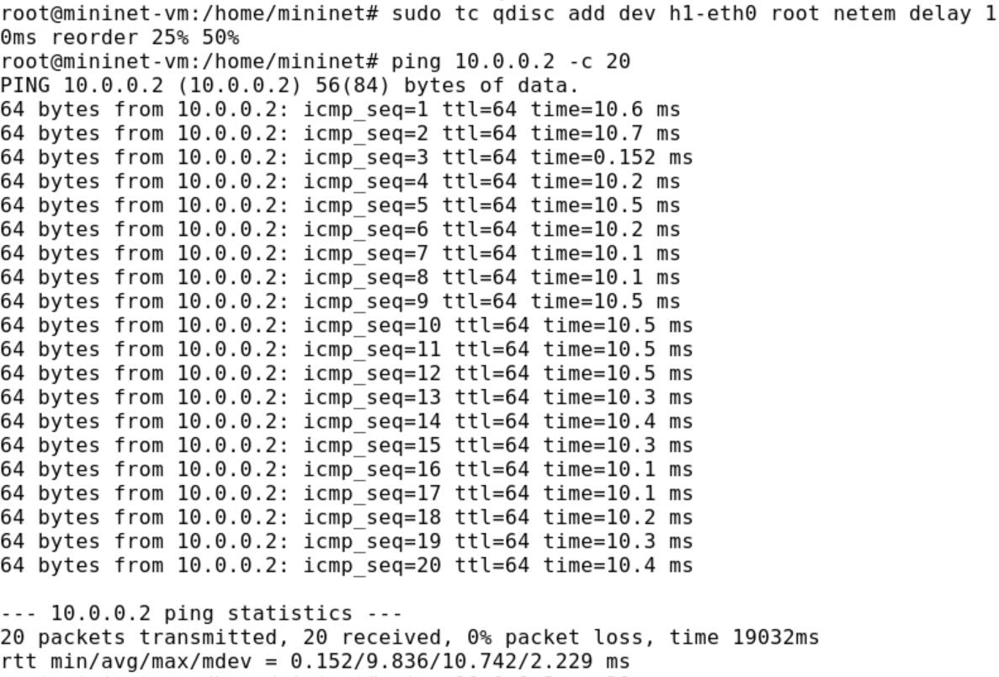{#fig:018 width=70%}

## 6.  Добавление дублирования пакетов в интерфейс подключения к эмулируемой глобальной сети

1. При необходимости восстановите конфигурацию интерфейсов по умолчанию
на узлах h1 и h2.
2. Для интерфейса узла h1 задайте правило c дублированием 50% пакетов (т.е.
50% пакетов должны быть получены дважды):

3. Проверьте, что на соединении от хоста h1 к хосту h2 имеются дублированные
пакеты, используя команду ping с параметром -c 20 с хоста h1. Дубликаты
пакетов помечаются как DUP!. Измеренная скорость дублирования пакетов
будет приближаться к настроенной скорости по мере выполнения большего
количества попыток.

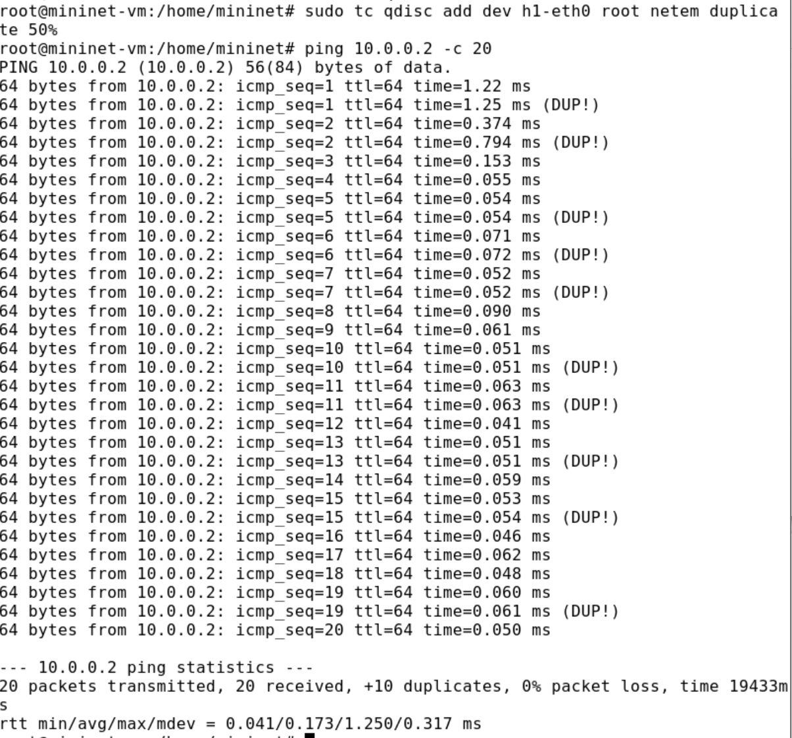{#fig:019 width=70%}

## 7. Воспроизведение экспериментов

1. Для каждого воспроизводимого эксперимента expname создайте свой каталог, в котором будут размещаться файлы эксперимента:

{#fig:020 width=70%}

##

1. В виртуальной среде mininet в своём рабочем каталоге с проектами создайте
каталог simple-drop и перейдите в него:

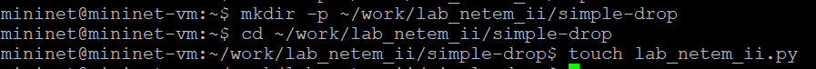{#fig:021 width=70%}

##

2. Создаёте скрипт для эксперимента lab_netem_ii.py:

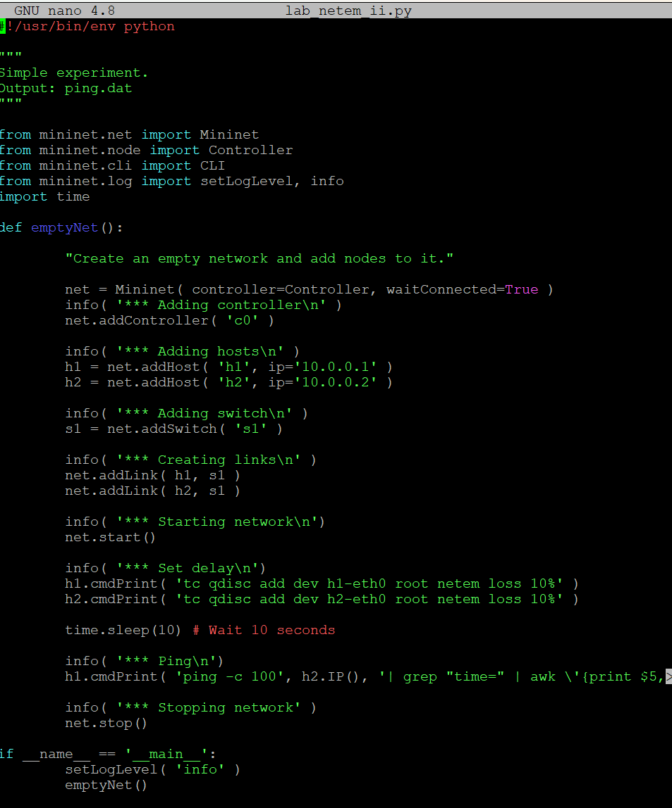{#fig:022 width=70%}

##

4. Скорректируйте скрипт так, чтобы на экран или в отдельный файл выводилась информация о потерях пакетов.

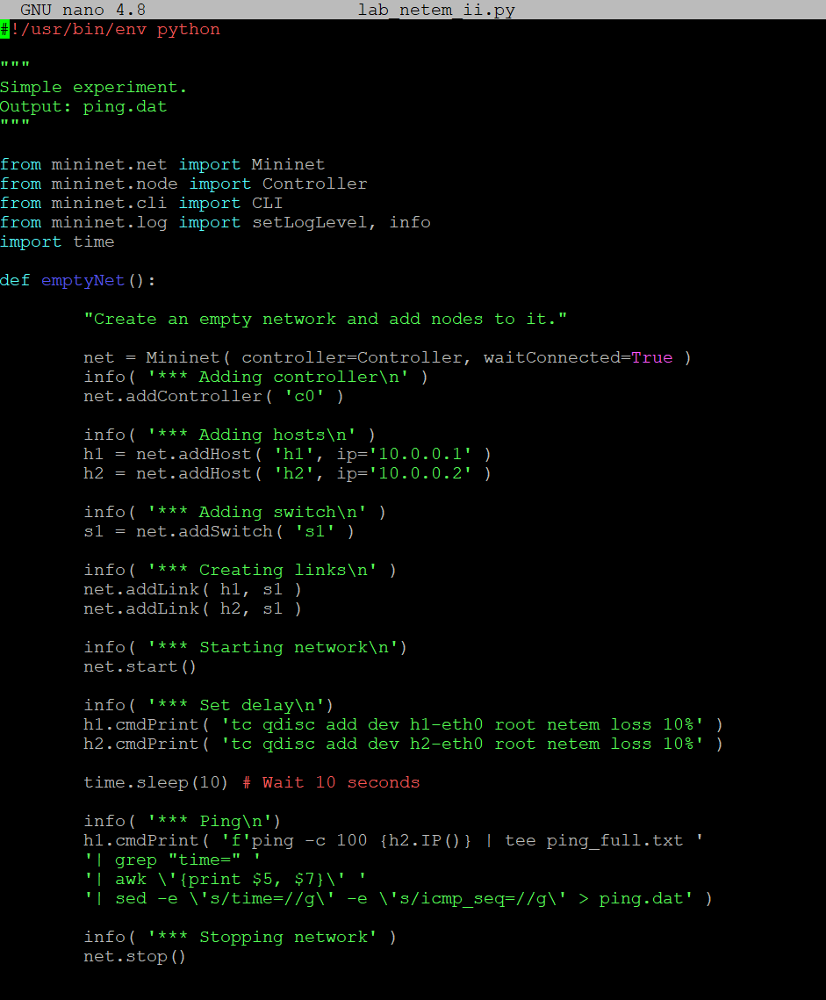{#fig:023 width=70%}

##

5. Создайте Makefile для управления процессом проведения эксперимента:

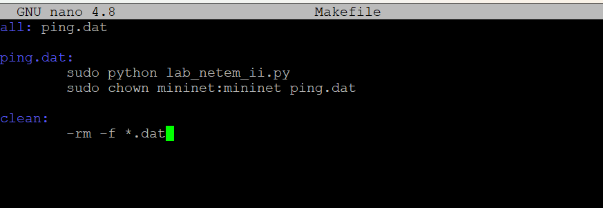{#fig:024 width=70%}

##

6. Выполните эксперимент:

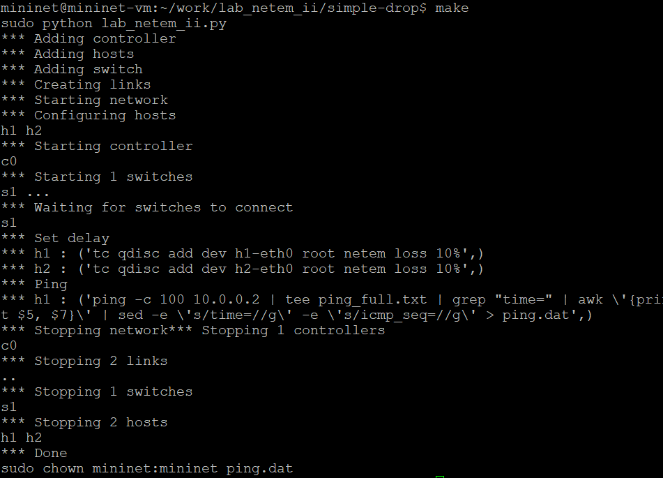{#fig:025 width=70%}

##

7. Очистите каталог от результатов проведения экспериментов:

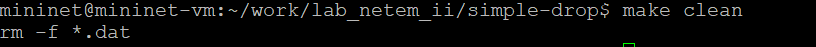{#fig:026 width=70%}

## Вывод

Я получила навыки проведения интерактивных экспериментов в среде Mininet по исследованию параметров сети, связанных с потерей, дублированием, изменением порядка и повреждением пакетов при передаче данных.

