---
## Front matter
lang: ru-RU
title: Лабораторная работа №6
subtitle: Настройка пропускной способности глобальной сети с помощью Token Bucket Filter
author:
  - Барабанова Кристина
institute:
  - Российский университет дружбы народов, Москва, Россия

## i18n babel
babel-lang: russian
babel-otherlangs: english

## Formatting pdf
toc: false
toc-title: Содержание
slide_level: 2
aspectratio: 169
section-titles: true

header-includes:
  - \usepackage{fontspec}
  - \setmainfont{DejaVu Serif}
  - \setsansfont{DejaVu Sans}
  - \setmonofont{DejaVu Sans Mono}
---

## Цель работы

Основной целью работы является знакомство с принципами работы дисциплины очереди Token Bucket Filter, которая формирует входящий/исходящий
трафик для ограничения пропускной способности, а также получение навыков
моделирования и исследования поведения трафика посредством проведения
интерактивного и воспроизводимого экспериментов в Mininet.

## Задание

1. Задайте топологию (рис. 6.3), состоящую из двух хостов и двух коммутаторов
с назначенной по умолчанию mininet сетью 10.0.0.0/8.

2. Проведите интерактивные эксперименты по ограничению пропускной способности сети с помощью TBF в эмулируемой глобальной сети.
3. Самостоятельно реализуйте воспроизводимые эксперимент по применению
TBF для ограничения пропускной способности. Постройте соответствующие
графики.

# Выполнение лабораторной работы

## 1. Запуск лабораторной топологии

1. Запустите виртуальную среду с mininet.
2. Из основной ОС подключитесь к виртуальной машине:

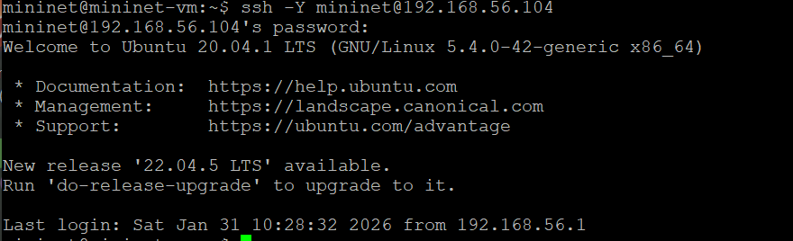{#fig:001 width=70%}

## 

3. В виртуальной машине mininet при необходимости исправьте права запуска
X-соединения. Скопируйте значение куки (MIT magic cookie)1
своего пользователя mininet в файл для пользователя root:

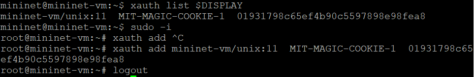{#fig:002 width=70%}

##

4. Задайте топологию сети, состоящую из двух хостов и двух коммутаторов
с назначенной по умолчанию mininet сетью 10.0.0.0/8:

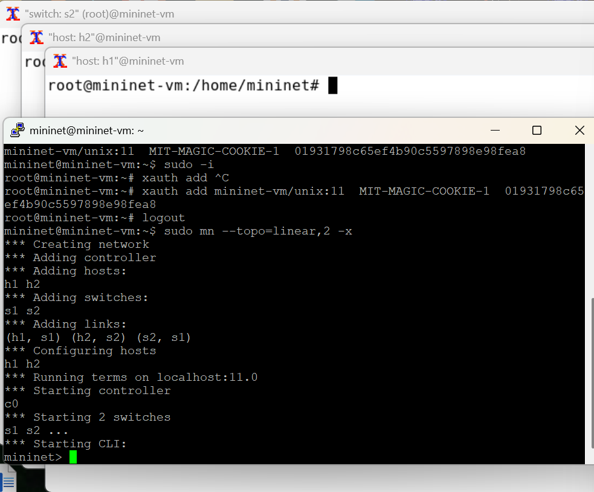{#fig:003 width=70%}

##

5. На хостах h1, h2 и на коммутаторах s1, s2 введите команду ifconfig, чтобы
отобразить информацию, относящуюся к их сетевым интерфейсам и назначенным им IP-адресам. 

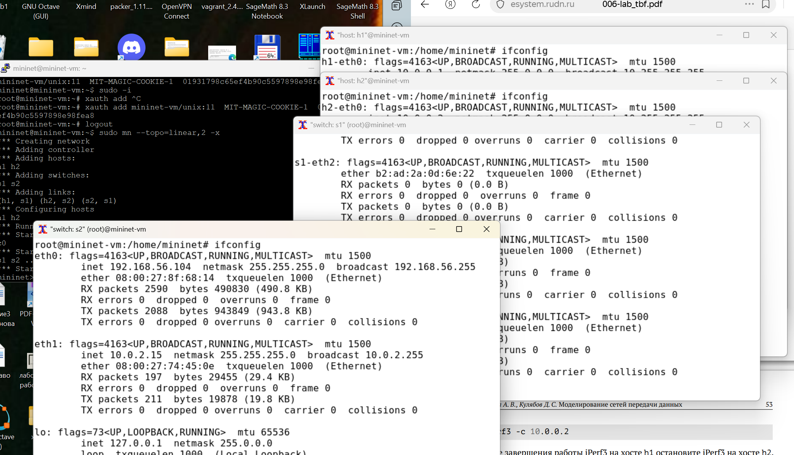{#fig:004 width=70%}

##

6. Проверьте подключение между хостами h1 и h2 с помощью команды ping
с параметром -c 4.

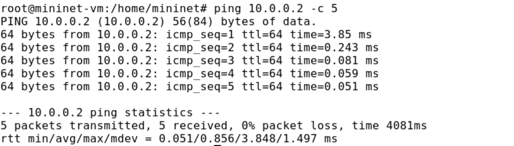{#fig:005 width=70%}

##

7. В терминале хоста h2 запустите iPerf3 в режиме сервера:

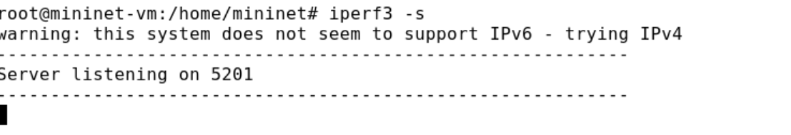{#fig:006 width=70%}

8. В терминале хоста h1 запустите iPerf3 в режиме клиента:

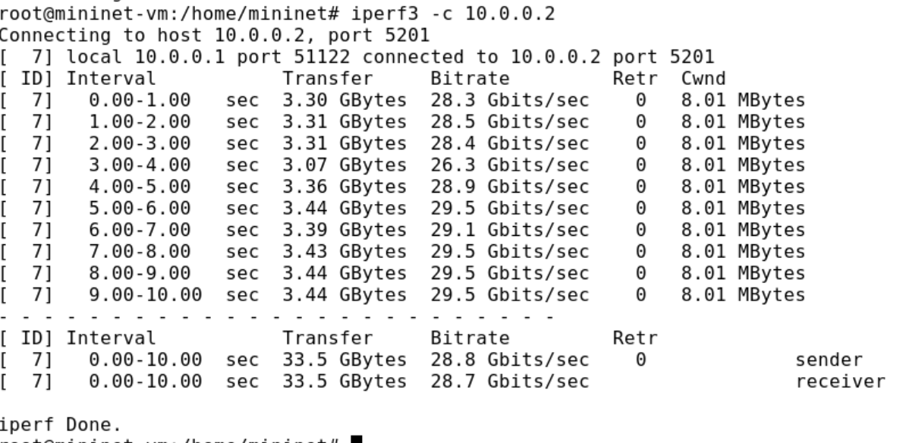{#fig:007 width=70%}

## 2. Ограничение скорости на конечных хостах

Команду tc можно применить к сетевому интерфейсу устройства для формирования исходящего трафика. Требуется ограничить скорость отправки данных
с конечного хоста с помощью фильтра Token Bucket Filter (tbf).
1. Измените пропускную способность хоста h1, установив пропускную способность на 10 Гбит/с на интерфейсе h1-eth0 и параметры TBF-фильтра:

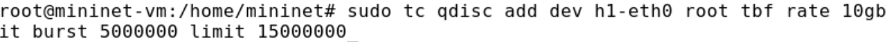{#fig:008 width=60%}

##

3. С помощью iPerf3 проверьте, что значение пропускной способности изменилось:
– В терминале хоста h2 запустите iPerf3 в режиме сервера:

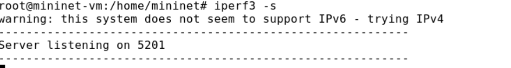{#fig:009 width=50%}

– В терминале хоста h2 запустите iPerf3 в режиме клиента:

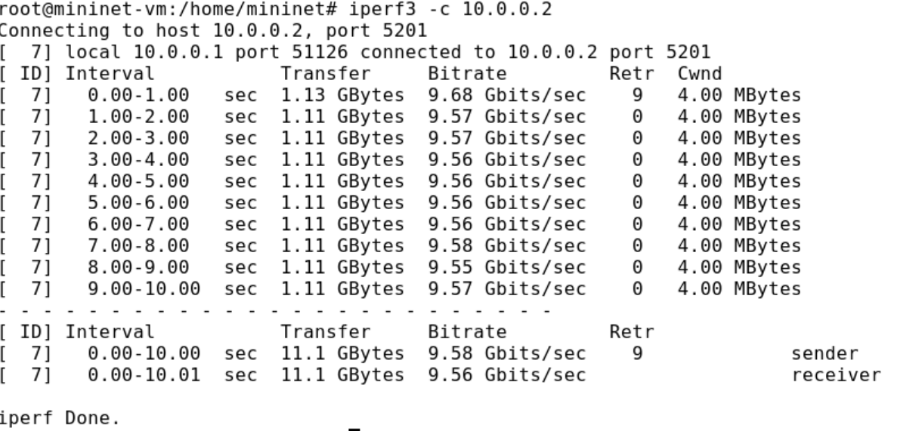{#fig:010 width=50%}

##

4. Удалите модифицированную конфигурацию на хосте h1:

{#fig:011 width=70%}

## 3. Ограничение скорости на коммутаторах

При ограничении скорости на интерфейсе s1-eth2 коммутатора s1 все сеансы связи между коммутатором s1 и коммутатором s2 будут фильтроваться
в соответствии с применяемыми правилами.
1. Примените правило ограничения скорости tbf с параметрами rate = 10gbit,
burst = 5,000,000, limit= 15,000,000 к интерфейсу s1-eth2 коммутатора s1,
который соединяет его с коммутатором s2:

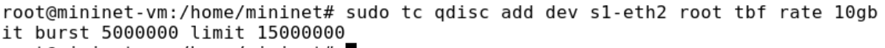{#fig:012 width=60%}

##

2. Проверьте конфигурацию с помощью инструмента iperf3 для измерения
пропускной способности:
– В терминале хоста h2 запустите iPerf3 в режиме сервера

– В терминале хоста h2 запустите iPerf3 в режиме клиента:

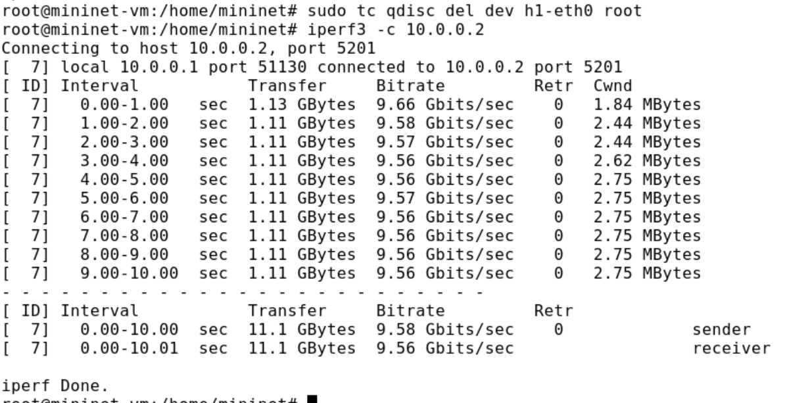{#fig:013 width=60%}

##

3. Удалите модифицированную конфигурацию на коммутаторе s1:

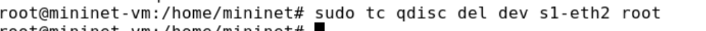{#fig:014 width=70%}

## 4. Объединение NETEM и TBF

NETEM используется для изменения задержки, джиттера, повреждения пакетов и т.д. TBF может использоваться для ограничения скорости. Утилита tc
позволяет комбинировать несколько модулей. При этом первая дисциплина
очереди (qdisc1) присоединяется к корневой метке, последующие дисциплины
очереди можно прикрепить к своим родителям, указав правильную метку.
1. Объедините NETEM и TBF, введя на интерфейсе s1-eth2 коммутатора s1
задержку, джиттер, повреждение пакетов и указав скорость:

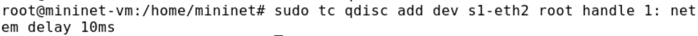{#fig:015 width=60%}

##

2. Убедитесь, что соединение от хоста h1 к хосту h2 имеет заданную задержку.
Для этого запустите команду ping с параметром -c 4 с терминала хоста h1

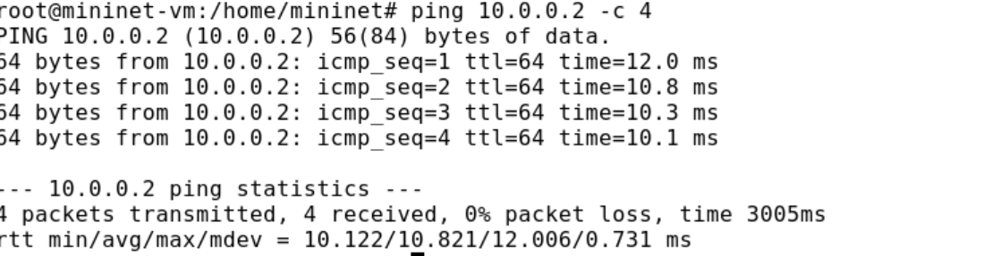{#fig:016 width=70%}

##

3. Добавьте второе правило на коммутаторе s1, которое задаёт ограничение скорости с помощью tbf с параметрами rate=2gbit, burst=1,000,000,
limit=2,000,000:

{#fig:017 width=70%}

##

4. Проверьте конфигурацию с помощью инструмента iperf3 для измерения
пропускной способности:
– В терминале хоста h2 запустите iPerf3 в режиме сервера:

– В терминале хоста h2 запустите iPerf3 в режиме клиента:

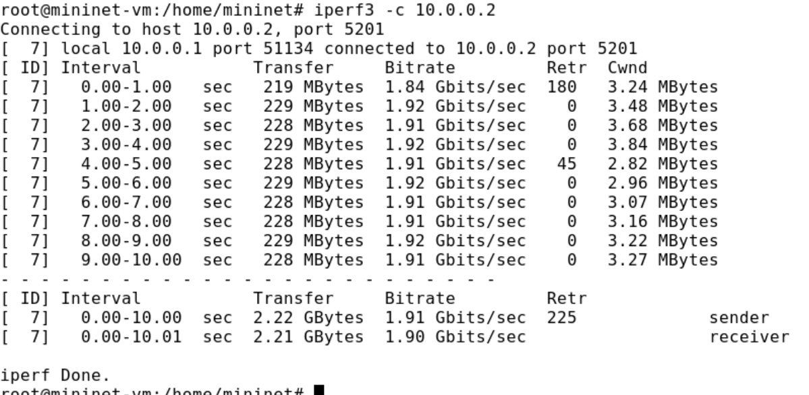{#fig:018 width=60%}

## 5. Воспроизводимые эксперименты

Создала каталог для экспееримента

Написала скрипт для эксперимента

{#fig:019 width=60%}

##

Задала права доступа к файлу скрипта

Создала Makefile для управления процессом проведения эксперимента

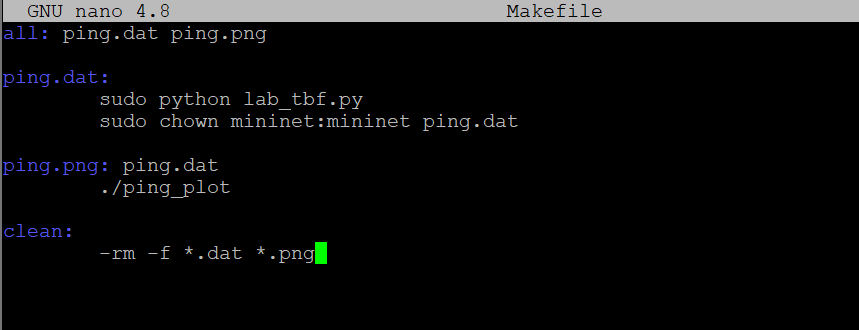{#fig:021 width=60%}

##

Выполнила экперимент

Построила график

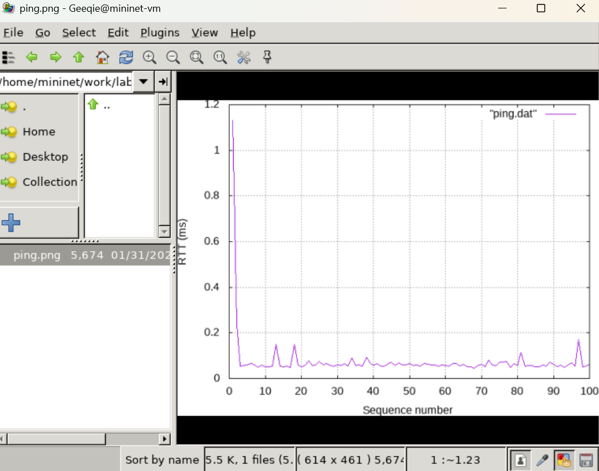{#fig:022 width=60%}

##

Очистила каталог от результатов проведения экспериментов

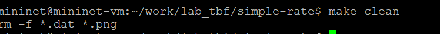{#fig:023 width=70%}

## Вывод

Я познакомилась с принципами работы дисциплины очереди Token Bucket Filter, которая формирует входящий/исходящий трафик для ограничения пропускной способности, а также получила навыки моделирования и исследования поведения трафика посредством проведения интерактивного и воспроизводимого экспериментов в Mininet.

